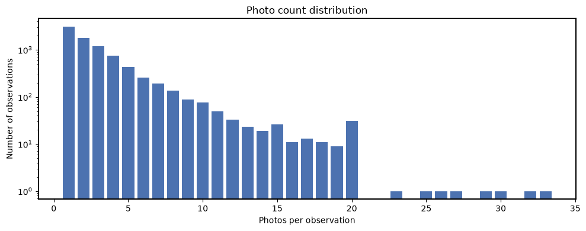
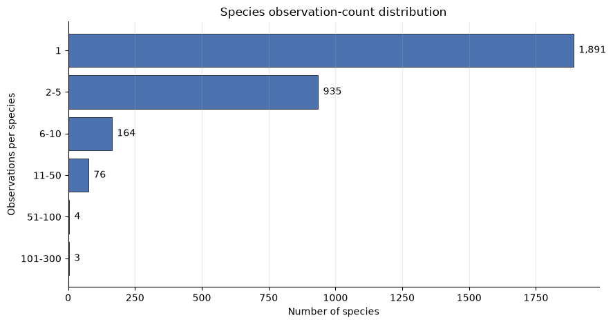
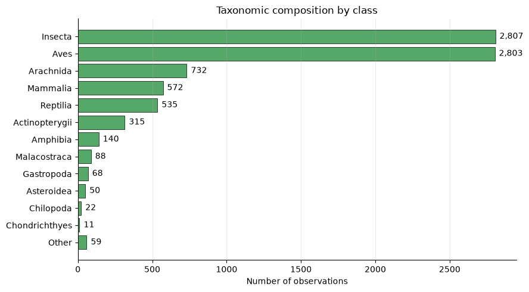
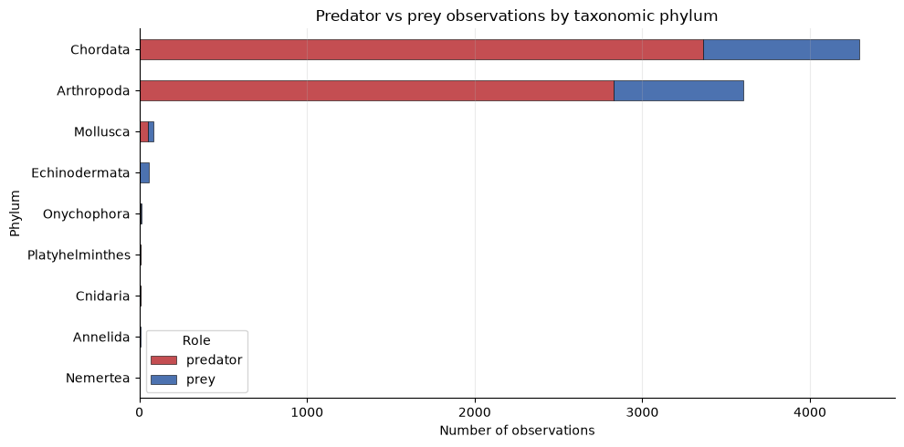
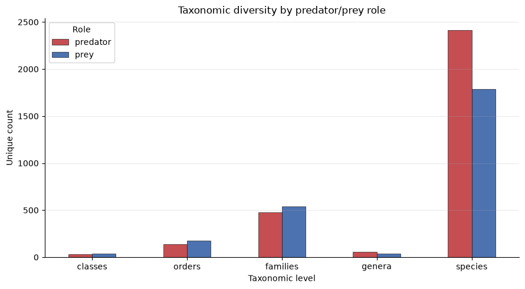
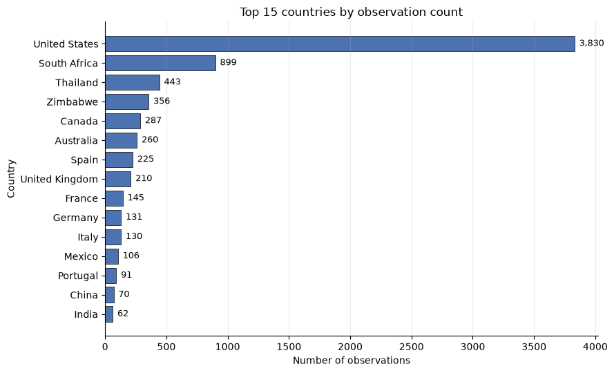
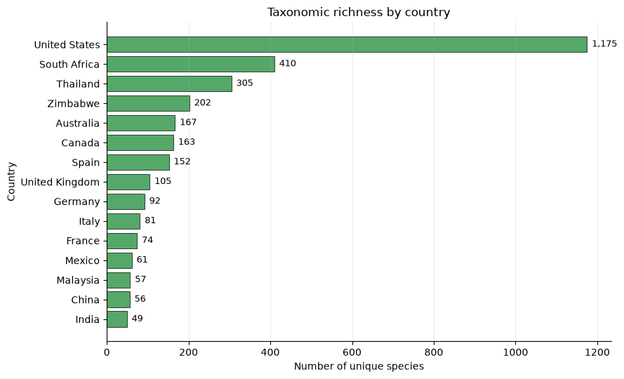

# Dataset Evaluation basis report - For Animalia

## Summary
### Overview
 
- **Total number of records:** 8221
- **Total number of columns (final dataset):** 30
- **Unique observations:** 8221
- **Total number of images:** 24457
- **Columns** : `obs_id`, `obs_url`, `quality_grade`, `obs_license_code`, `predator_prey_role`, `scientific_name`, `taxon_rank`, `common_name`,`latitude`, `longitude`, `positional_accuracy`, `photo_count`,`kingdom_name`, `phylum_name`, `class_name`, `order_name`,`family_name`, `genus_name`, `species_name`, `subspecies_name`,`subfamily_name`, `hybrid_name`, `complex_name`, `form_name`,`subgenus_name`, `variety_name`, `tribe_name`, `country`, `state`,`city`

### 📷 Photo Statistics
**Photo Count Distribution** 
 
| Photos per Observation | Count |
|------------------------|------:|
| 1 | 3077 |
| 2 | 1787 |
| 3+ | 3357 |
 
**Summary Statistics**
 
| Metric | Value |
|---------|-------:|
| Mean photos per observation | 2.97 |
| Median photos per observation | 2 |
| Maximum photos per observation | 33 |
| Minimum photos per observation | 1 |

 
### Data Quality Checks `update this`
| Check | Result |
|---------|------:|
| Unsupported licenses | 0 |
| Missing species labels | 0 |
| Missing photos | 0 |
| Duplicate observations | 0 |
 

> The dataset contains **10,387 unique observations** and **30,315 associated images**, averaging **2.92 photos per observation**. No missing species labels, missing photos, unsupported licenses, or duplicate observations were identified, indicating a high-quality and well-curated dataset. `update this`

## Data cleaning steps taken

### 🧹 Taxon Rank column Distribution

| taxon_rank | count |
|------------|------:|
| species | 7052 |
| subspecies | 940 |
| genus | 107 |
| hybrid | 44 |
| variety | 26 |
| complex | 21 |
| subgenus | 11 |
| tribe | 11 |
| subfamily | 6 |
| form | 3 |

**Count of records where taxon_rank is not equal to "species" -  1169**

| # | Column | Non-Null Count |
|---|--------|---------------:|
| 0 | obs_id | 8221 |
| 1 | scientific_name | 8221 |
| 2 | taxon_rank | 8221 |
| 3 | kingdom_name | 8221 |
| 4 | phylum_name | 8221 |
| 5 | class_name | 8202 |
| 6 | order_name | 8210 |
| 7 | family_name | 8220 |
| 8 | genus_name | 107 |
| 9 | species_name | 8021 |
| 10 | subspecies_name | 940 |
| 11 | subfamily_name | 6 |
| 12 | hybrid_name | 44 |
| 13 | complex_name | 21 |
| 14 | form_name | 3 |
| 15 | subgenus_name | 11 |
| 16 | variety_name | 26 |
| 17 | tribe_name | 11 |

## Characterization:
   
### Observation License Ditribution
| obs_license_code | count |
|------------------|------:|
| cc-by-nc | 5076 |
| cc-by | 2506 |
| cc0 | 375 |
| cc-by-nc-nd | 129 |
| cc-by-nc-sa | 98 |
| cc-by-sa | 35 |
| cc-by-nd | 2 |

These are creative licensed observations. So, I am proceeding with the analysis on these.

### Photo Count distribution
| Statistic | Photo Count |
|-----------|------------:|
| Count | 8221.00 |
| Mean | 2.97 |
| Standard Deviation | 2.92 |
| Minimum | 1.00 |
| 25th Percentile | 1.00 |
| Median (50%) | 2.00 |
| 75th Percentile | 4.00 |
| Maximum | 33.00 |

- Total number of images in this dataset is **24457**
- Photos per observation plot: \
    

### Taxonomic Composition - Animalia kingdom
| Taxonomic Rank | Unique Count |
|----------------|-------------:|
| Phylum         | 9            |
| Class          | 29           |
| Order          | 148          |
| Family         | 629          |
| Genus          | 71           |
| Species        | 3073         |

### What percentage of observations belong to top 5 in each rank till Family?
- Phylum:
    | Phylum Name | Count | Percentage (%) |
    |-------------|------:|---------------:|
    | Chordata | 4378 | 53.25 |
    | Arthropoda | 3667 | 44.61 |
    | Mollusca | 84 | 1.02 |
    | Echinodermata | 59 | 0.72 |
    | Onychophora | 11 | 0.13 |
- Class:
    | Class Name | Count | Percentage (%) |
    |------------|------:|---------------:|
    | Insecta | 2807 | 34.14 |
    | Aves | 2803 | 34.10 |
    | Arachnida | 732 | 8.90 |
    | Mammalia | 572 | 6.96 |
    | Reptilia | 535 | 6.51 |

- Order:
    | Order Name | Count | Percentage (%) |
    |------------|------:|---------------:|
    | Passeriformes | 977 | 11.88 |
    | Lepidoptera | 842 | 10.24 |
    | Hymenoptera | 791 | 9.62 |
    | Araneae | 565 | 6.87 |
    | Squamata | 451 | 5.49 |
- Family:
    | Family Name | Count | Percentage (%) |
    |-------------|------:|---------------:|
    | Apidae | 393 | 4.78 |
    | Laridae | 236 | 2.87 |
    | Accipitridae | 228 | 2.77 |
    | Ardeidae | 228 | 2.77 |
    | Nymphalidae | 189 | 2.30 |

#### What are the most represented species? 
| Species Name | Count | Percentage (%) |
|--------------|------:|---------------:|
| Apis mellifera | 155 | 1.89 |
| Aceria theospyri | 115 | 1.40 |
| Halcyon albiventris | 108 | 1.31 |
| Pandion haliaetus | 93 | 1.13 |
| Ardea herodias | 87 | 1.06 |

#### What percentage of images belong to each phylum group?  
| Phylum Name | Count |
|-------------|------:|
| Chordata | 13,404 |
| Arthropoda | 10,622 |
| Mollusca | 241 |
| Echinodermata | 79 |
| Onychophora | 38 |
| Cnidaria | 30 |
| Platyhelminthes | 22 |
| Annelida | 17 |
| Nemertea | 4 |

### What are the observation and photo count distribution under animalia for each phylum?
-  Observation distribution per phylum under animalia
    | Phylum Name      | Count |
    |------------------|------:|
    | Chordata         | 4378  |
    | Arthropoda       | 3667  |
    | Mollusca         | 84    |
    | Echinodermata    | 59    |
    | Onychophora      | 11    |
    | Platyhelminthes  | 8     |
    | Cnidaria         | 8     |
    | Annelida         | 5     |
    | Nemertea         | 1     |
- Photo count distribution per phylum under animalia
    | Phylum Name     | Photo Count |
    |-----------------|------------:|
    | Chordata        | 13,404 |
    | Arthropoda      | 10,622 |
    | Mollusca        | 241 |
    | Echinodermata   | 79 |
    | Onychophora     | 38 |
    | Cnidaria        | 30 |
    | Platyhelminthes | 22 |
    | Annelida        | 17 |
    | Nemertea        | 4 |

#### How many species have:- 

#### What proportion of all images comes from the top 1%, 5%, and 10% most common species?
* Top 1% species (31 species): 4,031 images (16.82% of all images)
* Top 5% species (154 species): 8,075 images (33.70% of all images)
* Top 10% species (308 species): 10,784 images (45.00% of all images)
* Top 30% species (922 species): 16,102 images (67.19% of all images)
* Top 50% species (1,537 species): 18,842 images (78.63% of all images)

### Taxonomic composition by major class 
- Class \
    

### Predator versus prey composition
#### How many observations are labeled predator and prey? What percentage is predator versus prey?
| Predator/Prey Role | Count | Percentage (%) |
|-------------------|------:|---------------:|
| Predator | 6,269 | 77.7 |
| Prey | 1,799 | 23.2 |

#### How many observations with no roles and which taxa rank govern it?
- There are **153** observations with no roles defined.
- Class distribution of those observation is as below.

    | Class | Count | Class Description |
    |---------|------:|------------|
    | **Insecta** | 65 | Insects such as butterflies, beetles, ants, bees, flies, and dragonflies. They have six legs, a segmented body, and are the most diverse animal group on Earth. |
    | **Mammalia** | 40 | Mammals such as lions, deer, bats, elephants, and humans. They are warm-blooded vertebrates characterized by hair or fur and the ability of females to produce milk for their young. |
    | **Aves** | 23 | Birds such as eagles, sparrows, owls, and parrots. They have feathers, wings, and beaks, and most species can fly. |
    | **Reptilia** | 22 | Reptiles such as snakes, lizards, turtles, and crocodiles. They are cold-blooded vertebrates with scaly skin and usually lay eggs. |
    | **Arachnida** | 2 | Arachnids such as spiders, scorpions, ticks, and mites. They typically have eight legs and lack antennae. |
    | **Amphibia** | 1 | Amphibians such as frogs, toads, salamanders, and newts. They generally have a life cycle that includes both aquatic and terrestrial stages. |

#### Are some taxa disproportionately represented as predator or prey?

| phylum_name | predator | prey | total | predator_share (%) | prey_share (%) |
|-------------|----------:|-----:|------:|-------------------:|---------------:|
| Chordata | 3361 | 931 | 4292 | 78.31 | 21.69 |
| Arthropoda | 2828 | 772 | 3600 | 78.56 | 21.44 |
| Mollusca | 50 | 34 | 84 | 59.52 | 40.48 |
| Echinodermata | 3 | 56 | 59 | 5.08 | 94.92 |
| Onychophora | 9 | 2 | 11 | 81.82 | 18.18 |
| Platyhelminthes | 8 | 0 | 8 | 100.00 | 0.00 |
| Cnidaria | 7 | 1 | 8 | 87.50 | 12.50 |
| Annelida | 2 | 3 | 5 | 40.00 | 60.00 |
| Nemertea | 1 | 0 | 1 | 100.00 | 0.00 |

**Key Insights**

1. Chordata and Arthropoda dominate the dataset
    - Chordata (4,292 records) and Arthropoda (3,600 records) account for the overwhelming majority of observations.
    - Together, they contribute 7,892 of 8,068 total records (~98% of the dataset).
2. Predators strongly outnumber prey in the major phyla
    - Both Chordata and Arthropoda show nearly identical predator dominance:
        - Chordata: 78.3% predators vs. 21.7% prey.
        - Arthropoda: 78.6% predators vs. 21.4% prey.
    - This indicates that predator interactions are heavily represented within the two largest phyla.
3. Echinodermata is strongly prey-dominated
    - Echinodermata exhibits the opposite pattern from most phyla:
        - 94.9% prey
        - 5.1% predators
    - It is the most prey-dominated phylum in the dataset.
4. Some phyla are exclusively represented as predators
    - Platyhelminthes and Nemertea have:
        - 100% predator representation.
        - No prey records.
    - These groups appear only in predator roles within the available data.
5. Mollusca shows the most balanced predator-prey distribution
    - Mollusca has:
        - 59.5% predators
        - 40.5% prey
    - Compared with other phyla, it displays the most even predator-prey split.
6. Small phyla have limited sample sizes
    - Onychophora (11 records), Platyhelminthes (8), Cnidaria (8), Annelida (5), and Nemertea (1) have very low counts.
    - Percentage-based interpretations for these groups should be treated cautiously due to the small sample sizes.
7. Predator dominance is the overall trend
    - Excluding Echinodermata and Annelida, every phylum is majority predator.
    - This suggests a strong predator-skew in the dataset, either due to ecological patterns, sampling strategy, or reporting bias.

>The dataset is overwhelmingly driven by Chordata and Arthropoda, both of which are approximately 78% predator records. While most phyla are predator-dominated, Echinodermata stands out as strongly prey-dominated.Several smaller phyla are represented exclusively as predators, although their low sample sizes limit broad ecological conclusions. Overall, predator records substantially exceed prey records across the taxonomic groups examined.

#### Is taxonomic diversity similar across the two roles?

#### Is image count balanced between predator and prey?

| predator_prey_role | observations | images | mean_images_per_observation | median_images_per_observation | image_share_percent |
|-------------------|------------:|-------:|----------------------------:|------------------------------:|--------------------:|
| predator | 6,269 | 18,994 | 3.03 | 2.0 | 78.51 |
| prey | 1,799 | 5,198 | 2.89 | 2.0 | 21.49 |

**Key Insights**

1. Predators dominate both observations and images
    - Predators account for 6,269 observations compared to 1,799 prey observations.
    - Predator records are associated with 18,994 images, versus 5,198 images for prey.
    - This indicates substantially greater representation of predators in the dataset.
2. Nearly 80% of all images belong to predator records
    - Predator images constitute 78.51% of all images.
    - Prey images account for only 21.49%.
    - The image distribution closely mirrors the observation distribution, suggesting balanced image collection across both groups.
3. Predators have slightly more images per observation
    - Predators average 3.03 images per observation.
    - Prey average 2.89 images per observation.
    - While the difference is small, predator observations tend to be documented with slightly more imagery.
4. Median image count is identical
    - Both predator and prey observations have a median of 2 images per observation.
    - This suggests that the typical observation in either group is supported by two images.
5. Mean exceeds median for both groups
    - Predators: mean = 3.03, median = 2.
    - Prey: mean = 2.89, median = 2.
    - This indicates a right-skewed distribution where a subset of observations contains many images, raising the average above the median.
6. Documentation intensity is broadly consistent
    - Despite major differences in total observations, the average number of images per record differs by only 0.14 images.
    - This suggests a relatively consistent documentation practice for predator and prey observations.

>The dataset contains far more predator observations and images than prey observations, with predators accounting for approximately 79% of all images. However, image documentation quality appears comparable across groups, as both predator and prey records have a median of two images per observation and similar average image counts. The primary difference is dataset volume rather than per-record documentation effort.

### Geographic coverage
#### How many observations have geographic information?
- There are **10371** observations which have country and city values
- There are **10360** observations which have state values. The null values for **11** values is because some country like singapore dont have provinces or states.

#### How many countries are represented?
- There are **118** countries represented.
- 

#### What are the top 5 countries by observation count and their percentages?
| Country | Count | Percentage (%) |
|----------|------:|---------------:|
| United States | 3,830 | 46.67 |
| South Africa | 899 | 10.95 |
| Thailand | 443 | 5.40 |
| Zimbabwe | 356 | 4.34 |
| Canada | 287 | 3.50 |

#### How geographically concentrated is the dataset?
- Countries represented: **118**
- Top 1 country share: **46.67%**
- Top 5 countries share: **70.85%**
- Top 10 countries share: **82.69%**

#### How many observations lack usable geographic metadata?
### Geographic Coverage Summary

- Total observations: **8221**
- Observations with country assigned: **8207**
- Observations missing country assignment: **14**
- Percent missing country assignment: **0.17%**

**Key takeaway:** Geographic attribution is highly complete, with country information available for **99.83%** of observations. Only **14 observations** (0.17%) could not be assigned to a country, indicating minimal geographic data loss and strong coverage for country-level analyses.

#### Does taxonomic richness vary by geographic region?
| Country | Observations | Images | Classes | Orders | Families | Genera | Species | Species per 100 Observations |
|----------|------------:|-------:|--------:|-------:|---------:|-------:|--------:|-----------------------------:|
| United States | 3,830 | 10,873 | 27 | 114 | 376 | 32 | 1,175 | 30.68 |
| South Africa | 899 | 4,714 | 11 | 53 | 176 | 6 | 410 | 45.61 |
| Thailand | 443 | 1,064 | 11 | 41 | 107 | 0 | 305 | 68.85 |
| Zimbabwe | 356 | 719 | 8 | 35 | 102 | 0 | 202 | 56.74 |
| Australia | 260 | 730 | 11 | 50 | 107 | 3 | 167 | 64.23 |
| Canada | 287 | 707 | 12 | 43 | 101 | 1 | 163 | 56.79 |
| Spain | 225 | 533 | 10 | 35 | 91 | 2 | 152 | 67.56 |
| United Kingdom | 210 | 611 | 10 | 35 | 68 | 1 | 105 | 50.00 |
| Germany | 131 | 451 | 8 | 33 | 72 | 1 | 92 | 70.23 |
| Italy | 130 | 284 | 9 | 30 | 61 | 2 | 81 | 62.31 |
| France | 145 | 295 | 8 | 26 | 54 | 2 | 74 | 51.03 |
| Mexico | 106 | 338 | 8 | 22 | 58 | 21 | 61 | 57.55 |
| Malaysia | 59 | 115 | 6 | 21 | 39 | 0 | 57 | 96.61 |
| China | 70 | 140 | 9 | 21 | 38 | 1 | 56 | 80.00 |
| India | 62 | 123 | 6 | 23 | 39 | 0 | 49 | 79.03 |

#### Are certain species heavily tied to particular countries?
**Top 20 species:**

| Species Name | Country | Observation Count | Species Total Observations | Country Share (%) |
|-------------|---------|------------------:|---------------------------:|------------------:|
| Aceria theospyri | United States | 115 | 115 | 100.0 |
| Halcyon albiventris | South Africa | 108 | 108 | 100.0 |
| Omphalocera munroei | United States | 86 | 86 | 100.0 |
| Evasterias troschelii | United States | 43 | 43 | 100.0 |
| Alligator mississippiensis | United States | 38 | 38 | 100.0 |
| Erythemis simplicicollis | United States | 38 | 38 | 100.0 |
| Larus glaucescens | United States | 29 | 29 | 100.0 |
| Platycryptus undatus | United States | 29 | 29 | 100.0 |
| Tetradactylus seps | South Africa | 27 | 27 | 100.0 |
| Phoenicopterus roseus | France | 24 | 24 | 100.0 |
| Buteo lineatus | United States | 22 | 22 | 100.0 |
| Larus occidentalis | United States | 18 | 18 | 100.0 |
| Nannopterum auritum | United States | 17 | 17 | 100.0 |
| Dione vanillae | United States | 14 | 14 | 100.0 |
| Lycorma delicatula | United States | 14 | 14 | 100.0 |
| Lepomis macrochirus | United States | 13 | 13 | 100.0 |
| Pachydiplax longipennis | United States | 13 | 13 | 100.0 |
| Argiope aurantia | United States | 12 | 12 | 100.0 |
| Eurytides marcellus | United States | 12 | 12 | 100.0 |
| Jadera haematoloma | United States | 12 | 12 | 100.0 |

**Key Findings**:
- Species with at least 5 observations where >=80% of observations come from one country: 200
- These species are geographically concentrated, with **100% of their recorded observations originating from a single country**.
- The **United States** dominates the list, accounting for **16 of the 20 country-restricted species** shown here.
- **Aceria theospyri** is the most frequently observed country-restricted species, with **115 observations**, all recorded in the **United States**.
- **Halcyon albiventris** represents the strongest country-specific record from **South Africa**, contributing **108 observations**, all from a single country.
- **Omphalocera munroei** is another highly concentrated species, with **86 observations**, all originating from the **United States**.
- Several well-represented species, including **Alligator mississippiensis**, **Erythemis simplicicollis**, **Larus glaucescens**, and **Platycryptus undatus**, appear exclusively in the **United States** within this dataset.
- **South Africa** contributes notable country-specific records, including **Halcyon albiventris** (108 observations) and **Tetradactylus seps** (27 observations).
- **Phoenicopterus roseus** appears exclusively in **France** within the dataset, with **24 observations**.
- The list covers a broad taxonomic range, including **birds, reptiles, insects, spiders, fishes, and marine invertebrates**, indicating that country-restricted observations are not confined to a single biological group.
- Observation counts are highly skewed, with the top three species (**Aceria theospyri**, **Halcyon albiventris**, and **Omphalocera munroei**) contributing substantially more records than the remaining species.
- The prevalence of species with a **100% country share** suggests a combination of **localized sampling effort, regional observer activity, data availability, and potentially restricted species distributions** within the dataset.
- These results should be interpreted as **dataset-level geographic concentration** rather than definitive evidence of true species endemism, as some species may occur in other countries but are not represented in the available observations.

#### Is the dataset overwhelmingly North American or broadly global?
| Region Group | Observations | Images | Species | Countries | Observation Share (%) |
|-------------|------------:|-------:|--------:|----------:|----------------------:|
| North America | 4,224 | 11,921 | 1,400 | 4 | 51.47 |
| Outside North America | 3,983 | 12,450 | 2,531 | 114 | 48.53 |

**Key Findings**:
- **North America contributes a slight majority of observations**, accounting for **4,224 observations (51.47%)** of the dataset.
- Despite having **241 fewer observations**, **Outside North America** contributes **more images** (**12,450 vs. 11,921**), indicating slightly richer photographic documentation per observation.
- **Outside North America contains substantially higher species diversity**, with **2,531 species** compared to **1,400 species** in North America.
- The **114 countries outside North America** collectively contribute nearly the same number of observations as **4 North American countries**, highlighting the global breadth of sampling outside the region.
- Species richness is much higher outside North America, with approximately **1.8× more species** recorded despite a similar number of observations.
- North America exhibits a **higher concentration of observations per species**, suggesting more intensive sampling, repeated observations, or stronger observer activity for the species represented there.
- In contrast, observations outside North America are distributed across a much larger number of species and countries, indicating **greater taxonomic and geographic diversity**.
- The near-equal split in observation share (**51.47% vs. 48.53%**) shows that the dataset has a strong global component rather than being overwhelmingly dominated by a single region.
- While North America drives observation volume, **Outside North America drives biodiversity representation**, contributing the majority of recorded species and geographic coverage.
- These results suggest two complementary strengths of the dataset:
  - **North America:** high observation density and documentation.
  - **Outside North America:** broader species diversity and geographic representation.

>The dataset is almost evenly split between North America and the rest of the world in terms of observations. However, regions outside North America contribute significantly greater biodiversity, recording **2,531 species across 114 countries**, compared with **1,400 species across 4 countries** in North America. This indicates that North America provides depth of observation, while the rest of the world provides breadth of taxonomic and geographic coverage.

### Long-tail and imbalance questions
#### Species frequency distribution?
- **Number of species**: 3,073
- **What is the median number of observations per species?** - 1
- **What percentage of species have fewer than 5 observations?**: 89.16%
- **What percentage of all observations belongs to the most common species?**: 1.93%

#### What is the Gini coefficient or another concentration statistic for species frequency?
- Gini coefficient, observations per species: **0.521**
- Gini coefficient, images per species: **0.608**

**Interpretation**:
- The **Gini coefficient for observations per species (0.521)** indicates a **moderate-to-high level of inequality** in how observations are distributed across species.
- A value of **0** would mean every species has exactly the same number of observations, while a value of **1** would mean all observations belong to a single species.
- With a Gini of **0.521**, the dataset shows that a relatively small subset of species accounts for a disproportionately large share of observations.
- The **Gini coefficient for images per species (0.608)** is even higher, indicating that image coverage is **more unevenly distributed** than observations.
- This suggests that some species receive substantially more photographic attention than others, regardless of the number of observations.
- The higher Gini for images (**0.608**) compared to observations (**0.521**) implies that:
  - Observation effort is already concentrated among certain species.
  - Image documentation is **even more concentrated** among those species.
- In other words, popular or charismatic species tend to accumulate not only more observations but also disproportionately more images.
- The dataset is not evenly representative of all species.
- A relatively small number of species are likely acting as **"dominant species"** in terms of observation and image counts.
- Rare, cryptic, less charismatic, or difficult-to-photograph species are likely underrepresented.

>The dataset exhibits a clear **long-tail distribution**: most observations and images are concentrated in a relatively small number of species, while many species are represented by only a few records. The higher inequality for images than observations suggests that photographic documentation is disproportionately focused on a subset of highly visible, common, or observer-favored species.

####  Image-level vs observation-level vs species-level distribution

| Level | Unit Count | Median per Species | Mean per Species | Gini by Species |
|---------|----------:|------------------:|-----------------:|----------------:|
| Image-level | 23,964 | 4.0 | 7.80 | 0.608 |
| Observation-level | 8,021 | 1.0 | 2.61 | 0.521 |
| Species-level | 3,073 | 1.0 | 1.00 | 0.000 |

**Interpretation**:
- The dataset where species is not null contains **23,964 images**, **8,021 observations**, and **3,073 species**.
- At the **observation level**, the median species is represented by just **one observation**, while the mean is **2.61 observations per species**. The difference between the median and mean indicates a long-tailed distribution in which a relatively small number of species contribute many observations.
- At the **image level**, the median species has **4 images**, while the mean is **7.80 images per species**. The larger gap between the mean and median further suggests that image coverage is concentrated among a subset of highly represented species.
- The **Gini coefficient of 0.521** for observations confirms moderate-to-high inequality in species representation across observations.
- The **Gini coefficient of 0.608** for images indicates even greater inequality in image coverage than in observation coverage, suggesting that some species are disproportionately well photographed.
- The **species-level Gini coefficient of 0.000** is expected because each species contributes exactly one record when species are aggregated at the species level.

**Key takeaways**
- Most species are represented by very few observations, with **50% of species having only one observation**.
- Image coverage is substantially more uneven than observation coverage (**Gini = 0.608 vs. 0.521**).
- The dataset exhibits a strong **long-tail distribution**, where many species are rare and a small number of species are highly sampled.

#### Top species share at image and observation level

| Metric | Percent (%) |
|----------|-----------:|
| Top 1 species observation share | 1.93 |
| Top 1 species image share | 1.37 |
| Top 5 species observation share | 6.96 |
| Top 5 species image share | 6.86 |
| Top 10 species observation share | 10.73 |
| Top 10 species image share | 9.45 |

**Interpretation**:
- The most observed species contributes only **1.93% of all observations**, indicating that no single species overwhelmingly dominates the dataset.
- Similarly, the most photographed species accounts for **1.37% of all images**, suggesting image coverage is distributed across many species rather than concentrated in a single taxon.
- The **top 5 species** collectively contribute **6.96% of observations** and **6.86% of images**, showing that even the most frequently recorded species represent a relatively small share of the overall dataset.
- The **top 10 species** account for **10.73% of observations** and **9.45% of images**, meaning nearly **90% of observations and images originate from species outside the top 10**.
- Observation concentration is consistently higher than image concentration, implying that while certain species are observed more frequently, image documentation is slightly more evenly distributed.
- The relatively low concentration percentages indicate that biodiversity representation is spread across a large number of species rather than being driven by a handful of highly dominant taxa.
- These results complement the Gini analysis: although species representation is unequal overall, the inequality emerges from the cumulative effect of many moderately represented species rather than extreme dominance by a few species.

**Key takeaways**
- No single species dominates the dataset, with the top species contributing less than **2% of observations**.
- The **top 10 species account for only about one-tenth of all observations and images**, demonstrating broad taxonomic coverage.
- Image coverage is slightly more evenly distributed than observation coverage among the most common species.
- The dataset exhibits a **diverse species composition**, where a large proportion of records are distributed across hundreds or thousands of species.
- Combined with the moderate-to-high Gini coefficients, these results indicate a **long-tail structure**: many species have few records, but dominance is spread across numerous species rather than concentrated in a very small elite group.
- The dataset appears relatively resilient to extreme species-level sampling bias, as even the most common species contribute only a small fraction of total observations and images.

#### Which taxonomic levels are most imbalanced?

| Taxonomic Level | Unique Groups | Median Observations per Group | Max Observations in One Group | Top Group Observation Share (%) | Top 5 Group Observation Share (%) | Observation Gini | Image Gini |
|----------------|-------------:|------------------------------:|------------------------------:|--------------------------------:|----------------------------------:|----------------:|-----------:|
| Class | 29 | 8.0 | 2,807 | 34.22 | 90.82 | 0.852 | 0.856 |
| Order | 148 | 6.0 | 977 | 11.90 | 44.17 | 0.825 | 0.829 |
| Family | 629 | 3.0 | 393 | 4.78 | 15.50 | 0.745 | 0.753 |
| Genus | 71 | 1.0 | 6 | 5.61 | 22.43 | 0.281 | 0.403 |
| Species | 3,073 | 1.0 | 155 | 1.93 | 6.96 | 0.521 | 0.608 |

**Interpretation**:
- The degree of concentration varies substantially across taxonomic levels, with the strongest imbalance observed at the **class** and **order** levels.
- At the **class level**, a single class accounts for **34.22% of all observations**, while the top five classes together contribute **90.82%** of observations. The extremely high **observation Gini (0.852)** and **image Gini (0.856)** indicate that observations and images are heavily concentrated within a few dominant classes.
- At the **order level**, concentration remains high. The most observed order contributes **11.90% of observations**, and the top five orders together account for **44.17%** of all observations. The high Gini coefficients (**0.825** for observations and **0.829** for images) suggest strong taxonomic skewness.
- At the **family level**, the distribution becomes more balanced. Although one family contributes **4.78%** of observations, the top five families account for only **15.50%**. Gini values decline substantially compared to class and order levels, indicating increased taxonomic diversity.
- At the **species level**, the most observed species contributes only **1.93%** of observations and the top five species together contribute **6.96%**. This shows that no individual species dominates the dataset, despite the moderate inequality reflected by the **species observation Gini (0.521)**.
- The **species-level image Gini (0.608)** exceeds the observation Gini, suggesting that image documentation is more concentrated than observation effort. Certain species attract disproportionately more photographic coverage.
- The **median observations per group decline from 8 (class) to 1 (species)**, reflecting the increasing granularity of the taxonomic hierarchy and the sparse representation of many lower-level taxa.
- Across all levels except genus, **image Gini values exceed observation Gini values**, indicating that image coverage is consistently more uneven than observation coverage.

**Key Takeaways**
- Taxonomic imbalance is strongest at higher levels (**class** and **order**), where a few groups dominate the majority of observations.
- The **top five classes account for over 90% of observations**, revealing a highly concentrated taxonomic composition.
- Taxonomic diversity increases markedly at lower levels (**family** and **species**), reducing dominance by individual groups.
- No single species dominates the dataset; the most observed species contributes less than **2% of all observations**.
- Image coverage is consistently more unequal than observation coverage, indicating that some taxa receive disproportionately greater photographic attention.
- The dataset exhibits a classic **hierarchical long-tail distribution**: strong concentration among a few higher taxonomic groups, combined with thousands of sparsely represented species.
- This pattern is common in biodiversity datasets and should be considered when conducting ecological analyses, estimating diversity metrics, or developing machine learning models, as dominant higher-level taxa may disproportionately influence results.

## Output Files:
- [animalia.parquet](../data/interim/animalia.parquet)
