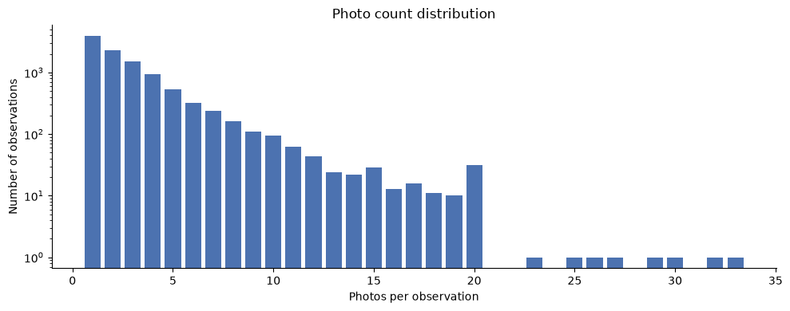
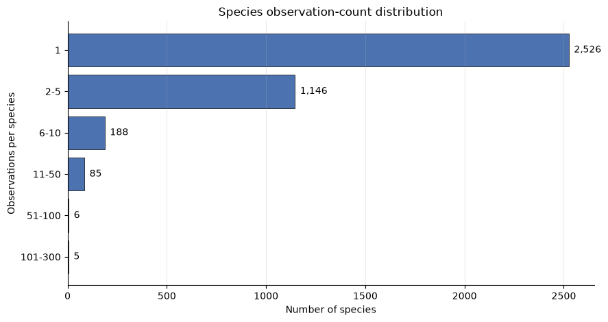
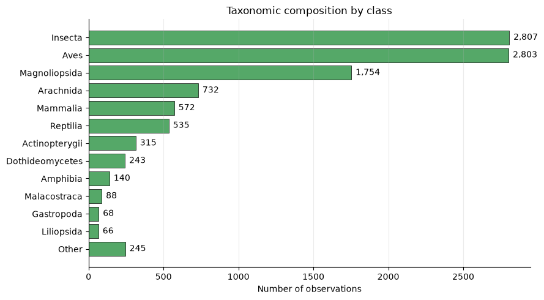
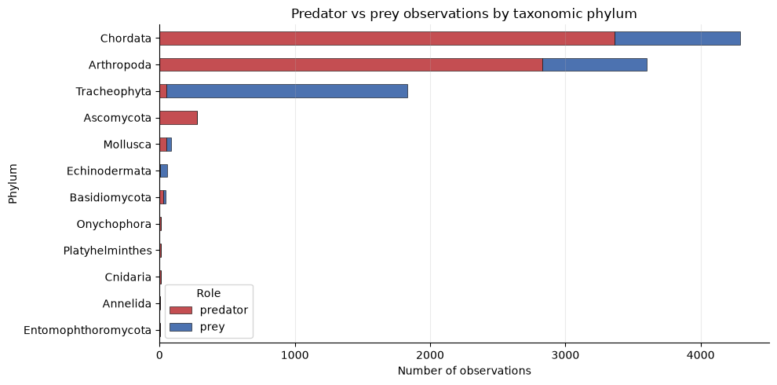
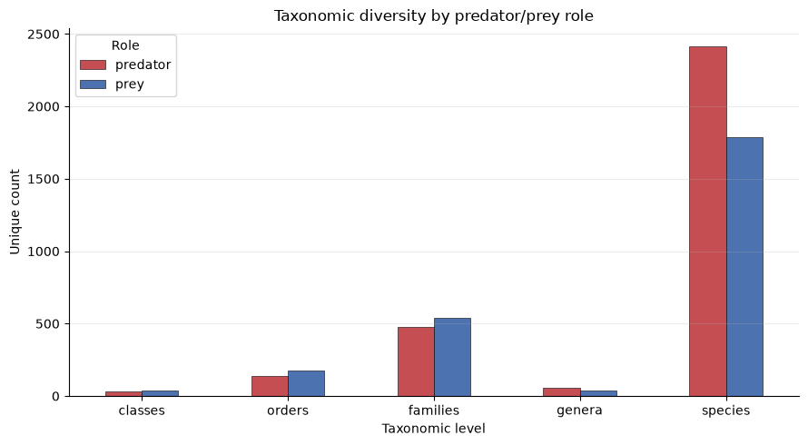
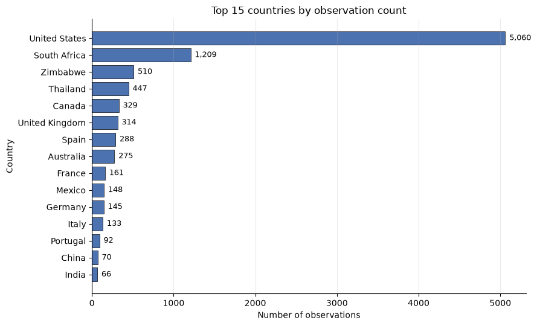
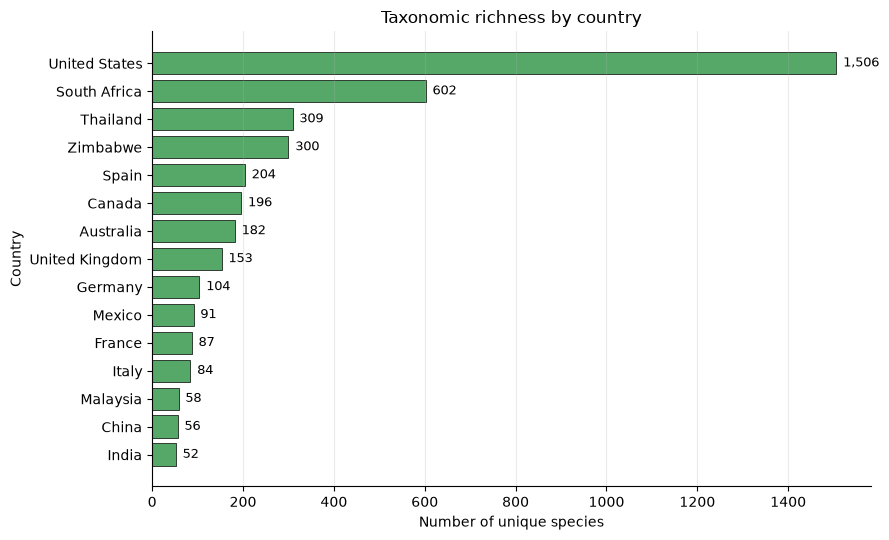

# Dataset Evaluation basis report

## Summary
### Overview
 
- **Total number of records:** 10,387
- **Total number of columns (final dataset):** 30
- **Unique observations:** 10,387
- **Total number of images:** 30,315
### 📷 Photo Statistics
**Photo Count Distribution**
 
| Photos per Observation | Count |
|------------------------|------:|
| 1 | 3,906 |
| 2 | 2,272 |
| 3+ | 4,209 |
 
**Summary Statistics**
 
| Metric | Value |
|---------|-------:|
| Mean photos per observation | 2.92 |
| Median photos per observation | 2 |
| Maximum photos per observation | 33 |
| Minimum photos per observation | 1 |

 
### Data Quality Checks
| Check | Result |
|---------|------:|
| Unsupported licenses | 0 |
| Missing species labels | 0 |
| Missing photos | 0 |
| Duplicate observations | 0 |
 

> The dataset contains **10,387 unique observations** and **30,315 associated images**, averaging **2.92 photos per observation**. No missing species labels, missing photos, unsupported licenses, or duplicate observations were identified, indicating a high-quality and well-curated dataset.

## Characterization:
   
### Observation License Ditribution
| S.No. | observation_license_code | Count |
|------:|--------------------------|------:|
| 1 | cc-by-nc | 6,347 |
| 2 | cc-by | 3,212 |
| 3 | cc0 | 543 |
| 4 | cc-by-nc-nd | 132 |
| 5 | cc-by-nc-sa | 113 |
| 6 | cc-by-sa | 36 |
| 7 | cc-by-nd | 4 |

These are creative licensed observations. So, I am proceeding with the analysis on these.

### Photo Count distribution
| Statistic | Photo Count |
|------------|------------:|
| count | 10,387 |
| mean | 2.918552 |
| std | 2.801287 |
| min | 1.000000 |
| 25% | 1.000000 |
| 50% | 2.000000 |
| 75% | 4.000000 |
| max | 33.000000 |

- Total number of images in this dataset is 30315
- Photos per observation plot: \
    

### Taxonomic Composition
| Taxonomic Rank | Unique Count |
|----------------|-------------:|
| Kingdom        | 7            |
| Phylum         | 18           |
| Class          | 50           |
| Order          | 222          |
| Family         | 803          |
| Genus          | 83           |
| Species        | 3956         |

### What percentage of observations belong to top 5 in each rank till Family?
- Kingdom:
    | Kingdom Name | Count | Percentage (%) |
    |--------------|------:|---------------:|
    | Animalia     | 8221  | 79.15 |
    | Plantae      | 1833  | 17.65 |
    | Fungi        | 328   | 3.16 |
    | Chromista    | 2     | 0.02 |
    | Bacteria     | 1     | 0.01 |
    | Protozoa     | 1     | 0.01 |
    | Viruses      | 1     | 0.01 |
- Phylum:
    | Phylum Name  | Count | Percentage (%) |
    |--------------|------:|---------------:|
    | Chordata     | 4378  | 42.15 |
    | Arthropoda   | 3667  | 35.30 |
    | Tracheophyta | 1833  | 17.65 |
    | Ascomycota   | 279   | 2.69 |
    | Mollusca     | 84    | 0.81 |
- Class:
    | Class Name     | Count | Percentage (%) |
    |----------------|------:|---------------:|
    | Insecta        | 2807  | 27.02 |
    | Aves           | 2803  | 26.99 |
    | Magnoliopsida  | 1754  | 16.89 |
    | Arachnida      | 732   | 7.05 |
    | Mammalia       | 572   | 5.51 |
- Order:
    | Order Name    | Count | Percentage (%) |
    |---------------|------:|---------------:|
    | Passeriformes | 977   | 9.41 |
    | Lepidoptera   | 842   | 8.11 |
    | Hymenoptera   | 791   | 7.62 |
    | Araneae       | 565   | 5.44 |
    | Squamata      | 451   | 4.34 |
- Family:
    | Family Name   | Count | Percentage (%) |
    |---------------|------:|---------------:|
    | Apidae        | 393   | 3.78 |
    | Ebenaceae     | 315   | 3.03 |
    | Asteraceae    | 241   | 2.32 |
    | Laridae       | 236   | 2.27 |
    | Accipitridae  | 228   | 2.20 |

#### What are the most represented species?
| Species Name                   | Count | Percentage (%) |
|--------------------------------|------:|---------------:|
| Diospyros virginiana           | 287   | 2.76 |
| Pseudocercospora fuliginosa    | 166   | 1.60 |
| Apis mellifera                 | 155   | 1.49 |
| Aceria theospyri               | 115   | 1.11 |
| Halcyon albiventris            | 108   | 1.04 |

#### What percentage of images belong to each major kingdom and phylum group?
- Kingdom
    | Kingdom Name | Count |
    |--------------|------:|
    | Animalia     | 24457 |
    | Plantae      | 5205  |
    | Fungi        | 640   |
    | Chromista    | 5     |
    | Protozoa     | 4     |
    | Bacteria     | 3     |
    | Viruses      | 1     |
- Phylum
    | Phylum Name  | Count |
    |--------------|------:|
    | Chordata     | 13404 |
    | Arthropoda   | 10622 |
    | Tracheophyta | 5205  |
    | Ascomycota   | 485   |
    | Mollusca     | 241   |

### What are the observation and photo count distribution under animalia for each phylum?
-  Observation distribution per phylum under animalia
    | Phylum Name      | Count |
    |------------------|------:|
    | Chordata         | 4378  |
    | Arthropoda       | 3667  |
    | Mollusca         | 84    |
    | Echinodermata    | 59    |
    | Onychophora      | 11    |
    | Platyhelminthes  | 8     |
    | Cnidaria         | 8     |
    | Annelida         | 5     |
    | Nemertea         | 1     |
- Photo count distribution per phylum under animalia
    | Phylum Name     | Photo Count |
    |-----------------|------------:|
    | Chordata        | 13,404 |
    | Arthropoda      | 10,622 |
    | Mollusca        | 241 |
    | Echinodermata   | 79 |
    | Onychophora     | 38 |
    | Cnidaria        | 30 |
    | Platyhelminthes | 22 |
    | Annelida        | 17 |
    | Nemertea        | 4 |

#### How many species have:- 

#### What proportion of all images comes from the top 1%, 5%, and 10% most common species?
* Top 1% species (40 species): 5,517 images (18.54% of all images)
* Top 5% species (198 species): 10,472 images (35.19% of all images)
* Top 10% species (396 species): 13,511 images (45.41% of all images)
* Top 30% species (1,187 species): 19,897 images (66.87% of all images)
* Top 50% species (1,978 species): 23,148 images (77.80% of all images)

### Taxonomic composition by major class
- Class \
    

### Predator versus prey composition
#### How many observations are labeled predator and prey? What percentage is predator versus prey?
| Predator/Prey Role | Count | Percentage (%) |
|-------------------|------:|---------------:|
| Predator | 6,633 | 64.81 |
| Prey | 3,601 | 35.19 |

#### How many observations with no roles and which taxa rank govern it?
- There are **153** observations with no roles defined.
- Class distribution of those observation is as below.

    | Class | Count | Class Description |
    |---------|------:|------------|
    | **Insecta** | 65 | Insects such as butterflies, beetles, ants, bees, flies, and dragonflies. They have six legs, a segmented body, and are the most diverse animal group on Earth. |
    | **Mammalia** | 40 | Mammals such as lions, deer, bats, elephants, and humans. They are warm-blooded vertebrates characterized by hair or fur and the ability of females to produce milk for their young. |
    | **Aves** | 23 | Birds such as eagles, sparrows, owls, and parrots. They have feathers, wings, and beaks, and most species can fly. |
    | **Reptilia** | 22 | Reptiles such as snakes, lizards, turtles, and crocodiles. They are cold-blooded vertebrates with scaly skin and usually lay eggs. |
    | **Arachnida** | 2 | Arachnids such as spiders, scorpions, ticks, and mites. They typically have eight legs and lack antennae. |
    | **Amphibia** | 1 | Amphibians such as frogs, toads, salamanders, and newts. They generally have a life cycle that includes both aquatic and terrestrial stages. |

#### Are some taxa disproportionately represented as predator or prey?

| Phylum | Predator | Prey | Total | Predator Share (%) | Prey Share (%) | Description |
|---------|---------:|-----:|------:|-------------------:|---------------:|------------|
| **Chordata** | 3,361 | 931 | 4,292 | 78.31 | 21.69 | Animals with a backbone, including mammals, birds, reptiles, amphibians, and fishes. |
| **Arthropoda** | 2,828 | 772 | 3,600 | 78.56 | 21.44 | Invertebrates with exoskeletons and jointed legs, including insects, spiders, and crustaceans. |
| **Tracheophyta** | 53 | 1,780 | 1,833 | 2.89 | 97.11 | Vascular plants, including trees, shrubs, grasses, and flowering plants. |
| **Ascomycota** | 275 | 4 | 279 | 98.57 | 1.43 | Sac fungi, including yeasts, molds, and truffles. |
| **Mollusca** | 50 | 34 | 84 | 59.52 | 40.48 | Soft-bodied animals such as snails, slugs, clams, octopuses, and squids. |
| **Echinodermata** | 3 | 56 | 59 | 5.08 | 94.92 | Marine animals including sea stars, sea urchins, and sea cucumbers. |
| **Basidiomycota** | 30 | 15 | 45 | 66.67 | 33.33 | Club fungi, including mushrooms, puffballs, and rust fungi. |
| **Onychophora** | 9 | 2 | 11 | 81.82 | 18.18 | Velvet worms, soft-bodied invertebrates that actively hunt small prey. |
| **Platyhelminthes** | 8 | 0 | 8 | 100.00 | 0.00 | Flatworms, including free-living and parasitic species. |
| **Cnidaria** | 7 | 1 | 8 | 87.50 | 12.50 | Jellyfish, corals, sea anemones, and hydras. |
| **Annelida** | 2 | 3 | 5 | 40.00 | 60.00 | Segmented worms, including earthworms and leeches. |
| **Entomophthoromycota** | 4 | 0 | 4 | 100.00 | 0.00 | Fungi that often infect and kill insects and other arthropods. |
| **Mycetozoa** | 0 | 1 | 1 | 0.00 | 100.00 | Slime molds, amoeba-like organisms that are neither plants nor true fungi. |
| **Nemertea** | 1 | 0 | 1 | 100.00 | 0.00 | Ribbon worms, many of which are active predators in marine environments. |
| **Oomycota** | 1 | 0 | 1 | 100.00 | 0.00 | Water molds and related organisms, some of which are important pathogens. |
| **Ochrophyta** | 0 | 1 | 1 | 0.00 | 100.00 | A diverse group including brown algae and diatoms. |
| **Pisuviricota** | 1 | 0 | 1 | 100.00 | 0.00 | A phylum of RNA viruses that infect a variety of hosts. |
| **Proteobacteria** | 0 | 1 | 1 | 0.00 | 100.00 | A large and diverse bacterial phylum containing many ecologically important species. |

**Key Insights**

1. **Chordata and Arthropoda dominate the dataset**
   - Together they account for **7,892 records** (about 77% of all observations).
   - Both are strongly predator-dominated, with approximately **78% predators** and **22% prey**.

2. **Plants are overwhelmingly prey**
   - **Tracheophyta** (vascular plants) contains **1,780 prey records** and only **53 predator records**.
   - This reflects the ecological role of plants as the primary food source for many herbivores.

3. **Fungi are mostly predator-associated**
   - **Ascomycota** is almost entirely predator-associated (**98.6% predator**).
   - Many species represented in ecological interaction datasets are pathogens, decomposers, or organisms that exploit other species.

4. **Marine prey groups**
   - **Echinodermata** (sea stars, sea urchins, sea cucumbers) is predominantly prey (**94.9%**).
   - These organisms are frequently consumed by fishes, birds, and other marine predators.

5. **Small phyla should be interpreted cautiously**
   - Groups like **Nemertea**, **Oomycota**, **Pisuviricota**, and **Mycetozoa** have only one observation each.
   - Their 100% predator or prey shares are driven by very small sample sizes and are not necessarily representative.

>The dataset follows a typical food-web structure: **Predators are primarily animals**

#### Is taxonomic diversity similar across the two roles?

#### Is image count balanced between predator and prey?

| Role | Observations | Images | Mean Images per Observation | Median Images per Observation | Share of All Images (%) |
|--------|------------:|--------:|---------------------------:|------------------------------:|------------------------:|
| **Predator** | 6,633 | 19,766 | 2.98 | 2.0 | 65.78 |
| **Prey** | 3,601 | 10,284 | 2.86 | 2.0 | 34.22 |

* What These Metrics Mean:
    - **Observations**: Individual predator-prey interaction records.
    - **Images**: Total photographs associated with those observations.
    - **Mean Images per Observation**: Average number of images available for each observation.
    - **Median Images per Observation**: The typical number of images per observation, less affected by observations with unusually large numbers of images.
    - **Image Share (%)**: Percentage of all images contributed by each ecological role.

**Key Findings**

1. Predators account for most images
    - Predator observations contribute **19,766 images**, representing **65.8% of all images**.
    - Prey observations contribute **10,284 images**, representing **34.2% of all images**.
    - This mirrors the overall observation distribution, where predator records are more numerous than prey records.
2. Image coverage is highly consistent across roles
    - Predators average **2.98 images per observation**.
    - Prey average **2.86 images per observation**.
    - The difference is small, indicating that both predator and prey observations receive similar photographic documentation.
3. Typical observation contains two images
    - The median number of images is **2** for both predators and prey.
    - This means that at least half of all observations in each category have two or fewer images.
    - The dataset therefore appears to follow a relatively standardized image collection process.
4. Predators are slightly better documented
    - Although the difference is modest, predator observations have:
        - More total images
        - Higher average

### Geographic coverage
#### How many observations have geographic information?
- There are **10371** observations which have country and city values
- There are **10360** observations which have state values. The null values for **11** values is because some country like singapore dont have provinces or states.

#### How many countries are represented?
- There are **119** countries represented.
- 

#### What are the top 5 countries by observation count and their percentages?
| Country        | Count | Percentage (%) |
|----------------|------:|---------------:|
| United States  | 5060  | 48.79 |
| South Africa   | 1209  | 11.66 |
| Zimbabwe       | 510   | 4.92  |
| Thailand       | 447   | 4.31  |
| Canada         | 329   | 3.17  |

#### How geographically concentrated is the dataset?
- Countries represented: **119**
- Top 1 country share: **48.79%**
- Top 5 countries share: **72.85%**
- Top 10 countries share: **84.28%**

**Key takeaway:** The dataset is highly concentrated geographically. Nearly half of all observations originate from the United States alone (48.79%), while the top 5 countries account for almost three-quarters of records (72.85%). Expanding to the top 10 countries captures more than four-fifths of all observations (84.28%), indicating substantial geographic imbalance in data coverage.

#### How many observations lack usable geographic metadata?
### Geographic Coverage Summary

- Total observations: **10,387**
- Observations with country assigned: **10,371**
- Observations missing country assignment: **16**
- Percent missing country assignment: **0.15%**

**Key takeaway:** Geographic attribution is highly complete, with country information available for **99.85%** of observations. Only **16 observations** (0.15%) could not be assigned to a country, indicating minimal geographic data loss and strong coverage for country-level analyses.

#### Does taxonomic richness vary by geographic region?
| Country | Observations | Images | Classes | Orders | Families | Genera | Species | Species per 100 Observations |
|----------|------------:|--------:|---------:|-------:|---------:|-------:|--------:|-----------------------------:|
| United States | 5,060 | 13,500 | 43 | 171 | 480 | 33 | 1,506 | 29.76 |
| South Africa | 1,209 | 6,228 | 14 | 81 | 236 | 6 | 602 | 49.79 |
| Thailand | 447 | 1,075 | 12 | 45 | 111 | 0 | 309 | 69.13 |
| Zimbabwe | 510 | 1,324 | 11 | 60 | 150 | 0 | 300 | 58.82 |
| Spain | 288 | 645 | 14 | 57 | 122 | 3 | 204 | 70.83 |
| Canada | 329 | 775 | 13 | 57 | 118 | 1 | 196 | 59.57 |
| Australia | 275 | 783 | 12 | 58 | 117 | 3 | 182 | 66.18 |
| United Kingdom | 314 | 830 | 13 | 56 | 93 | 5 | 153 | 48.73 |
| Germany | 145 | 487 | 10 | 43 | 82 | 1 | 104 | 71.72 |
| Mexico | 148 | 476 | 18 | 43 | 82 | 25 | 91 | 61.49 |
| France | 161 | 326 | 10 | 35 | 64 | 3 | 87 | 54.04 |
| Italy | 133 | 299 | 11 | 33 | 64 | 2 | 84 | 63.16 |
| Malaysia | 60 | 118 | 7 | 22 | 40 | 0 | 58 | 96.67 |
| China | 70 | 140 | 9 | 21 | 38 | 1 | 56 | 80.00 |
| India | 66 | 129 | 7 | 26 | 42 | 0 | 52 | 78.79 |

#### Are certain species heavily tied to particular countries?
**Top 20 species:**

| Species | Country | Observations | Total Species Observations | Country Share (%) |
|----------|----------|------------:|--------------------------:|------------------:|
| Diospyros virginiana | United States | 287 | 287 | 100.0 |
| Pseudocercospora fuliginosa | United States | 166 | 166 | 100.0 |
| Aceria theospyri | United States | 115 | 115 | 100.0 |
| Halcyon albiventris | South Africa | 108 | 108 | 100.0 |
| Asimina triloba | United States | 97 | 97 | 100.0 |
| Omphalocera munroei | United States | 86 | 86 | 100.0 |
| Phyllosticta asiminae | United States | 53 | 53 | 100.0 |
| Evasterias troschelii | United States | 43 | 43 | 100.0 |
| Alligator mississippiensis | United States | 38 | 38 | 100.0 |
| Erythemis simplicicollis | United States | 38 | 38 | 100.0 |
| Asimina obovata | United States | 33 | 33 | 100.0 |
| Larus glaucescens | United States | 29 | 29 | 100.0 |
| Platycryptus undatus | United States | 29 | 29 | 100.0 |
| Tetradactylus seps | South Africa | 27 | 27 | 100.0 |
| Asimina reticulata | United States | 26 | 26 | 100.0 |
| Asimina parviflora | United States | 24 | 24 | 100.0 |
| Phoenicopterus roseus | France | 24 | 24 | 100.0 |
| Buteo lineatus | United States | 22 | 22 | 100.0 |
| Asimina pygmaea | United States | 19 | 19 | 100.0 |
| Diospyros texana | United States | 18 | 18 | 100.0 |

**Key Findings**:
- Species with at least 5 observations where >=80% of observations come from one country: 238
- These species are geographically concentrated, with **100% of their observations originating from a single country**.
- The **United States** dominates the list, accounting for **17 of the top 20 country-restricted species** shown here.
- **Diospyros virginiana** is the most frequently observed country-restricted species, with **287 observations**, all from the United States.
- Several species associated with the genus **Asimina** (A. triloba, A. obovata, A. reticulata, A. parviflora, A. pygmaea) appear as exclusively observed in the United States within the dataset.
- **South Africa** contributes notable endemic or country-specific records, including **Halcyon albiventris** (108 observations) and **Tetradactylus seps** (27 observations).
- **Phoenicopterus roseus** appears exclusively in **France** within this dataset, with 24 observations.
- The prevalence of 100% country-share species suggests that part of the dataset captures taxa with restricted geographic ranges, localized sampling effort, or strong regional observer activity.

#### Is the dataset overwhelmingly North American or broadly global?
| Region Group | Observations | Images | Species | Countries | Observation Share (%) |
|--------------|------------:|--------:|--------:|----------:|----------------------:|
| North America | 5,538 | 14,754 | 1,794 | 4 | 53.40 |
| Outside North America | 4,833 | 15,470 | 3,104 | 115 | 46.60 |

**Key Findings**:
- The dataset is nearly balanced between **North America** and **Outside North America** in terms of observations, with North America contributing **53.40%** (5,538 observations) and the rest of the world contributing **46.60%** (4,833 observations).
- Despite having slightly fewer observations, countries **outside North America** contribute substantially greater taxonomic diversity, with **3,104 species** compared with **1,794 species** in North America.
- North American records originate from only **4 countries**, whereas the non-North American portion spans **115 countries**, indicating much broader geographic coverage outside the region.
- The number of images is comparable across groups, with **14,754 images** from North America and **15,470 images** from outside North America.
- Species richness per observation appears considerably higher outside North America. While North America contributes a larger share of observations, the rest of the world contributes nearly **73% more unique species** (3,104 vs. 1,794).
- These results suggest that the dataset's geographic concentration is driven largely by observation volume in a small number of North American countries, particularly the United States, while global records contribute a disproportionately large share of overall biodiversity.

### Long-tail and imbalance questions
#### Species frequency distribution?
- **Number of species**: 3,956
- **What is the median number of observations per species?** - 1
- **What percentage of species have fewer than 5 observations?**: 90.32%
- **What percentage of all observations belongs to the most common species?**: 2.82%

#### What is the Gini coefficient or another concentration statistic for species frequency?
- Gini coefficient, observations per species: 0.527
- Gini coefficient, images per species: 0.607

**Interpretation**:
- A Gini coefficient of **0** indicates perfect equality, where every species contributes the same number of observations or images.
- A Gini coefficient of **1** indicates complete inequality, where all observations or images belong to a single species.
- The **observation Gini coefficient (0.527)** indicates a moderate-to-high level of imbalance in species representation. A relatively small subset of species accounts for a disproportionately large fraction of observations.
- The **image Gini coefficient (0.607)** is even higher, suggesting that image coverage is more unevenly distributed than observations. Certain species have many more images per observation than others.
- The higher inequality in image counts compared with observation counts implies that image collection effort is concentrated among a subset of species, potentially reflecting factors such as species charisma, detectability, observer preferences, or ease of photographing.
- Overall, the dataset exhibits substantial long-tail behavior: many species are represented by relatively few observations and images, while a smaller number of species are heavily sampled and photographed.
- The dataset is **moderately imbalanced at the observation level (Gini = 0.527)** and **strongly imbalanced at the image level (Gini = 0.607)**.
####  Image-level vs observation-level vs species-level distribution
| Level | Unit Count | Median per Species | Mean per Species | Gini by Species |
|---------|----------:|------------------:|-----------------:|----------------:|
| Image-level | 29,755 | 4.0 | 7.52 | 0.607 |
| Observation-level | 10,164 | 1.0 | 2.57 | 0.527 |
| Species-level | 3,956 | 1.0 | 1.00 | 0.000 |

**Interpretation**:
- The dataset where species is not null contains **29,755 images**, **10,164 observations**, and **3,956 species**.
- At the **observation level**, the median species is represented by just **one observation**, while the mean is **2.57 observations per species**. The difference between the median and mean indicates a long-tailed distribution in which a relatively small number of species contribute many observations.
- At the **image level**, the median species has **4 images**, while the mean is **7.52 images per species**. The larger gap between the mean and median further suggests that image coverage is concentrated among a subset of highly represented species.
- The **Gini coefficient of 0.527** for observations confirms moderate-to-high inequality in species representation across observations.
- The **Gini coefficient of 0.607** for images indicates even greater inequality in image coverage than in observation coverage, suggesting that some species are disproportionately well photographed.
- The **species-level Gini coefficient of 0.000** is expected because each species contributes exactly one record when species are aggregated at the species level.
**Key takeaways**
- Most species are represented by very few observations, with **50% of species having only one observation**.
- Image coverage is substantially more uneven than observation coverage (**Gini = 0.607 vs. 0.527**).
- The dataset exhibits a strong **long-tail distribution**, where many species are rare and a small number of species are highly sampled.
- Such imbalance is common in biodiversity datasets and should be considered when interpreting ecological patterns or training machine learning models, as dominant species can disproportionately influence results.

#### Top species share at image and observation level

| Metric | Percent (%) |
|----------|-----------:|
| Top 1 species observation share | 2.82 |
| Top 1 species image share | 2.08 |
| Top 5 species observation share | 8.18 |
| Top 5 species image share | 6.32 |
| Top 10 species observation share | 12.56 |
| Top 10 species image share | 10.33 |

**Interpretation**:
- The most frequently observed species accounts for **2.82%** of all observations, while the most photographed species accounts for **2.08%** of all images.
- The top **5 species** contribute **8.18%** of observations and **6.32%** of images.
- The top **10 species** contribute **12.56%** of observations and **10.33%** of images.
- Although the dataset exhibits measurable imbalance (Gini coefficients of 0.527 for observations and 0.607 for images), dominance by the very top species is relatively limited.
- No single species overwhelmingly dominates the dataset. Even the most represented species accounts for less than **3%** of observations and just over **2%** of images.
- The concentration of observations and images is therefore distributed across a broader set of species rather than being driven by only a handful of highly represented taxa.

**Key Takeaways**:
- Species representation is uneven but not dominated by a few extreme outliers.
- The **top 10 species account for only about one-eighth of observations (12.56%)** and **one-tenth of images (10.33%)**.
- The observed imbalance arises primarily from a long-tail distribution with many infrequently represented species rather than from a small number of overwhelmingly dominant species.
- This pattern indicates relatively broad taxonomic coverage while still reflecting the common biodiversity-dataset challenge of sparse representation for many species.

#### Which taxonomic levels are most imbalanced?
| Taxonomic Level | Unique Groups | Median Observations per Group | Max Observations in One Group | Top Group Share (%) | Top 5 Groups Share (%) | Observation Gini | Image Gini |
|-----------------|--------------:|-----------------------------:|------------------------------:|-------------------:|----------------------:|----------------:|-----------:|
| Class | 50 | 5.5 | 2,807 | 27.07 | 83.60 | 0.883 | 0.888 |
| Order | 222 | 5.5 | 977 | 9.42 | 34.95 | 0.815 | 0.819 |
| Family | 803 | 3.0 | 393 | 3.79 | 13.61 | 0.751 | 0.755 |
| Species | 3,956 | 1.0 | 287 | 2.82 | 8.18 | 0.527 | 0.607 |
| Genus | 83 | 1.0 | 6 | 4.88 | 19.51 | 0.271 | 0.408 |

**Interpretation**:
- Taxonomic balance varies substantially across hierarchical levels, with inequality generally decreasing from higher taxonomic ranks (class, order) to lower ranks (species and genus).
- At the **class** level, representation is highly concentrated. The largest class contains **2,807 observations** and accounts for **27.07%** of all observations, while the top five classes account for **83.60%**. This is reflected in the extremely high observation and image Gini coefficients (**0.883** and **0.888**, respectively).
- At the **order** level, concentration remains strong. The largest order contributes **9.42%** of observations, and the top five orders account for **34.95%**. Observation and image inequality remain high (**Gini ≈ 0.82**).
- At the **family** level, representation becomes more distributed. The most represented family contributes only **3.79%** of observations, and the top five families account for **13.61%**. Corresponding Gini coefficients decline to approximately **0.75**.
- At the **species** level, the dataset exhibits a classic long-tail structure. There are **3,956 species**, half of which have only **one observation**. However, the most common species contributes just **2.82%** of observations, and the top five species account for only **8.18%**, indicating that no single species dominates the dataset.
- The **genus** level appears comparatively balanced, with the lowest inequality metrics (**observation Gini = 0.271**, **image Gini = 0.408**), suggesting a relatively even distribution across represented genera.
- Across every taxonomic level, image inequality slightly exceeds observation inequality, indicating that image collection is consistently more concentrated than observation collection.

**Key takeaways**:
1. **Strong imbalance exists at higher taxonomic ranks**, especially at the class and order levels.
2. **Species-level dominance is relatively modest**, despite the presence of many rare species.
3. The dataset's long-tail pattern arises from thousands of sparsely represented species rather than a handful of overwhelmingly dominant taxa.
4. **Image coverage is more uneven than observation coverage** across all taxonomic levels.
5. Taxonomic diversity broadens considerably at lower ranks, reducing concentration and improving representation balance.
6. Analyses performed at the class or order level may be strongly influenced by a few dominant groups, whereas species-level analyses benefit from broader representation despite substantial rarity.

## Data cleaning steps taken

### 🧹 Taxon Rank Distribution

| Taxon Rank | Count |
|------------|------:|
| species | 9,149 |
| subspecies | 962 |
| genus | 123 |
| variety | 50 |
| hybrid | 46 |
| complex | 25 |
| subgenus | 12 |
| tribe | 11 |
| subfamily | 6 |
| form | 3 |

**Count of records where taxon_rank is not equal to "species" -  1238**

| Column Name | Count |
|-------------|---------------:|
| observation_id | 1238 |
| taxon_rank | 1238 |
| taxon_name | 1238 |
| kingdom_name | 1238 | 
| phylum_name | 1238 |
| class_name | 1237 | 
| order_name | 1237 |
| genus_name | 1221 | 
| species_name | 1015 |

#### 🔄 Action_Taken: *Taxonomic ranks (`subspecies`, `subfamily`, `hybrid`, `complex`, `form`,  `subgenus`, `variety`, and `tribe`) were transformed into separate derived columns. The corresponding scientific name from `taxon_name` was populated in the appropriate derived column based on the observation's `taxon_rank`.*

### Normalize the Predator Prey role column:
* predator_prey_role column has 4 categories - 'eater', 'organism being eaten', 'thing being eaten', nan
    - 'eater' renamed to "predator"
    - 'organism being eaten' and ' thing being eaten' to "prey"

### Convert Latitudes and Longitude into country, state, city
    - using the library:gazetteer , reverse_geocode(Fallback)
    - There is unique **8470** latitude and longitude combination
    - We filled **7473** using gazetteer and **997* using reverse_geocode.
-----------------------------
### 🧹 Attributes cleaning
- There were *31* columns. *12* columns were removed and *8* were added. Current Total is *30*.
- **Removed Columns**: taxon_rank, country, state, town, county,"kingdom_id", "phylum_id","class_id", "order_id", "family_id", "genus_id","species_id",
- **New columns**: 'subspecies_name','subfamily_name', 'hybrid_name', 'complex_name', 'form_name','subgenus_name', 'variety_name', 'tribe_name', 'country','state', 'city'

| No. | Column name | Renamed_Column_name | How does this help? | Action taken | Remarks | Existing or Derived |
|---- |-------------|---------------------|---------------------|--------------|---------|---------------------|
| 1 | observation_id | obs_id | Unique identifier for each observation. Helps track and reference records. | 🔵 Retained | | Existing |
| 2 | observation_uri | obs_url | Direct link to the observation source. Useful for validation and audits. | 🔵 Retained |  | Existing |
| 3 | quality_grade | | Indicates observation quality (e.g., research grade). Helps assess data reliability. | 🔵 Retained | | Existing |
| 4 | observation_license_code | obs_license_code | Defines data usage restrictions. Important for compliance documentation. | 🔵 Retained | | Existing |
| 5 | predator_prey_role | | Describes ecological role in interactions. Useful for food web analysis. | 🔵 Retained | | Existing |
| 6 | taxon_id(check if required) | | Unique taxonomic identifier. Enables joins with other taxonomy datasets. | 🔵 Retained | | Existing | 
| 7 | taxon_name | scientific_name | Scientific name of the taxon. Core species identification field. | 🔵 Retained | | Existing |
| 8 | taxon_rank | | Taxonomic level (species, genus, family, etc.). Supports hierarchical analysis. | 🔴 Removed | Collapsed the value into columns | Existing | 
| 9 | preferred_common_name | common_name | Human-readable species name. Improves interpretability. | 🔵 Retained | | Existing |
| 10 | latitude | | Geographic coordinate. Required for spatial analysis and mapping. | 🔵 Retained | | Existing |
| 11 | longitude | | Geographic coordinate. Required for spatial analysis and mapping. | 🔵 Retained | | Existing |
| 12 | positional_accuracy | | Indicates precision of location data. Helps assess spatial reliability. | 🔵 Retained | Need to check if this is required| Existing |
| 13 | country | | Country where observation occurred. | 🔴 Removed | No values | Existing |
| 14 | state | | State/province of observation. | 🔴 Removed | No values | Existing |
| 15 | county | | County-level location information. | 🔴 Removed | No values | Existing |
| 16 | town | | Locality information. | 🔴 Removed | No values | Existing |
| 17 | photo_count | |  Number of photos attached. May indicate observation richness. | 🔵 Retained | | Existing |
| 18 | kingdom_id | | Taxonomic kingdom identifier. | 🔴 Removed | Name is the primary id | Existing |
| 19 | kingdom_name| | Kingdom name. Useful for broad classification. | 🔵 Retained | | Existing |
| 20 | phylum_id | |  Taxonomic phylum identifier. Supports taxonomy hierarchy. | 🔴 Removed | Name is the primary id | Existing |
| 21 | phylum_name| | Phylum name. Useful for classification and aggregation. | 🔵 Retained | | Existing |
| 22 | class_id | |  Taxonomic class identifier. Supports taxonomy hierarchy. | 🔴 Removed | Name is the primary id | Existing |
| 23 | class_name | |  Class name. Useful for classification and aggregation. | 🔵 Retained | | Existing |
| 24 | order_id | |  Taxonomic order identifier. Supports taxonomy hierarchy. | 🔴 Removed | Name is the primary id | Existing |
| 25 | order_name | |  Order name. Useful for classification and aggregation. | 🔵 Retained | | Existing |
| 26 | family_id | |  Taxonomic family identifier. Supports taxonomy hierarchy. | 🔴 Removed | Name is the primary id | Existing |
| 27 | family_name | |  Family name. Useful for classification and aggregation. | 🔵 Retained | | Existing |
| 28 | genus_id | |  Taxonomic genus identifier. Supports taxonomy hierarchy. | 🔴 Removed | Name is the primary id | Existing |
| 29 | genus_name | |  Genus name. Useful for classification and aggregation. | 🔵 Retained | | Existing |
| 30 | species_id | |  Species identifier. Enables species-level analysis. | 🔴 Removed | Name is the primary id | Existing |
| 31 | species_name | |  Scientific species name. Primary field for species analysis. | 🔵 Retained | | Existing |
| 32 | subspecies_name | | Captures subspecies-level taxonomy for observations where the taxon rank is subspecies. Enables more granular taxonomic analysis. | 🟢 Created | Derived from `taxon_name` based on `taxon_rank`. | Derived |
| 33 | subfamily_name | | Captures subfamily-level taxonomy for observations classified at the subfamily rank. Supports hierarchical taxonomic grouping. | 🟢 Created | Derived from `taxon_name` based on `taxon_rank`. | Derived |
| 34 | hybrid_name | | Stores hybrid taxon names separately, enabling analysis of hybrid organisms. | 🟢 Created | Derived from `taxon_name` based on `taxon_rank`. | Derived |
| 35 | complex_name | | Stores species complex names for observations identified at the complex rank. Facilitates analysis of species groups. | 🟢 Created | Derived from `taxon_name` based on `taxon_rank`. | Derived |
| 36 | form_name | | Captures taxonomic form information for detailed botanical and zoological analyses. | 🟢 Created | Derived from `taxon_name` based on `taxon_rank`. | Derived |
| 37 | subgenus_name | | Stores subgenus-level classifications to preserve additional taxonomic hierarchy. | 🟢 Created | Derived from `taxon_name` based on `taxon_rank`. | Derived |
| 38 | variety_name | | Captures variety-level taxonomy, particularly useful for plant-related analyses. | 🟢 Created | Derived from `taxon_name` based on `taxon_rank`. | Derived |
| 39 | tribe_name | | Stores tribe-level taxonomic classifications to support intermediate hierarchical grouping. | 🟢 Created | Derived from `taxon_name` based on `taxon_rank`. | Derived |
| 40 | country | | Country where observation occurred. | 🔴 Created | Added using python libraries with the help of `latitude` and `longitude` | Derived |
| 41 | state | | State/province of observation. | 🔴 Created | Added using python libraries with the help of `latitude` and `longitude` | Derived |
| 42 | city | | County-level location information. | 🔴 Created | Added using python libraries with the help of `latitude` and `longitude` | Derived |

## Output Files:

- [clean_obs.parquet](../data/interim/clean_obs.parquet)
