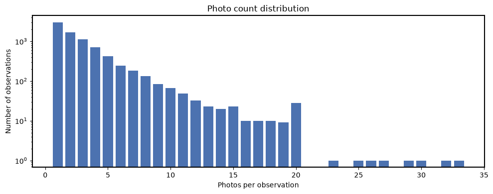
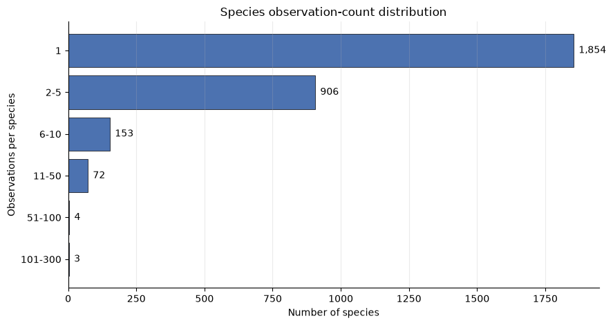
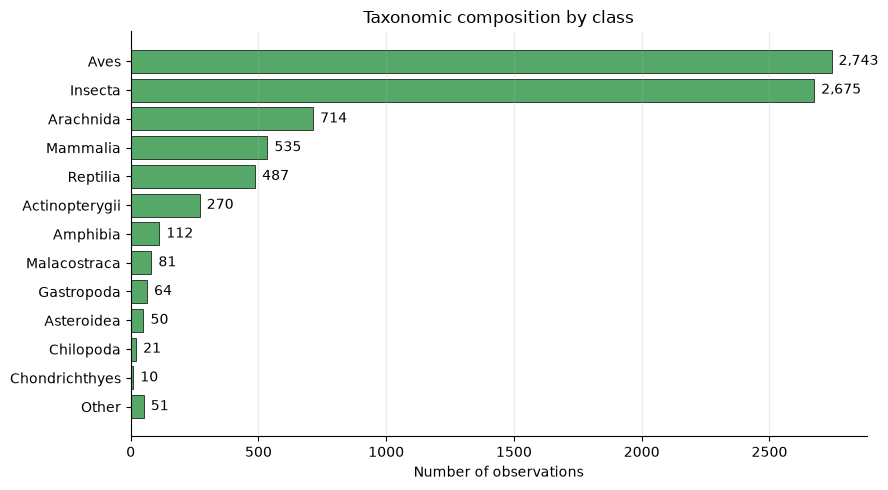
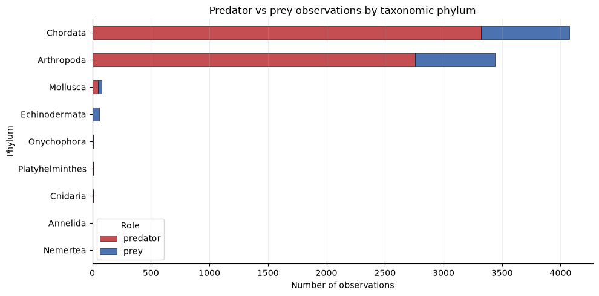
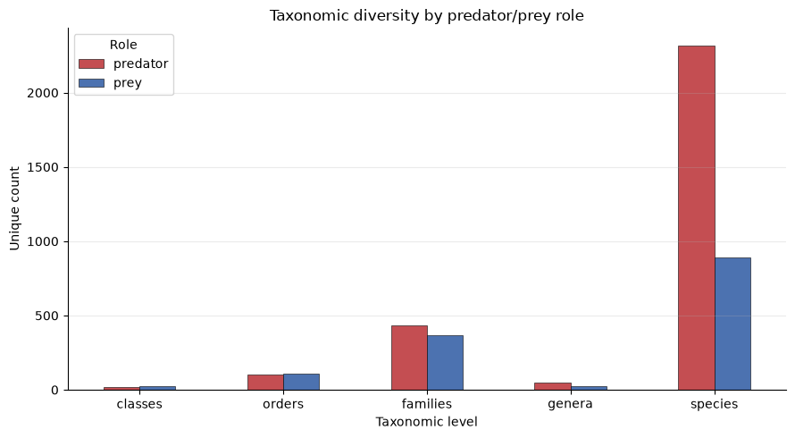
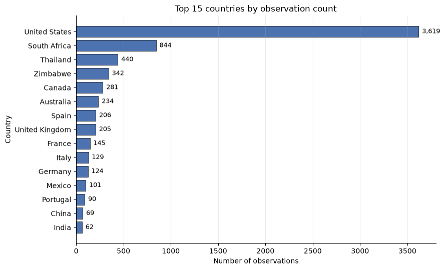
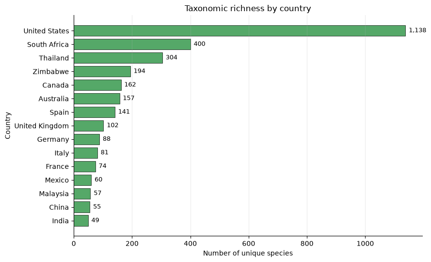

# Analysis from linking obs-photo
## Photos file analysis:
- Number of unique photos: **28544** (Note: The reason the count is less than the count in the observation file is because this only contains licensed photos)
- Number of unique photos in animalia: **23125**
- Columns in the photos file: `obs_id`, `photo_id`, `photo_license_code`, `url`
- Total number of columns: **33**
- columns in the final file: `obs_id`, `photo_id`, `photo_license_code`, `url`, `obs_url`,
       `quality_grade`, `obs_license_code`, `predator_prey_role`,
       `scientific_name`, `taxon_rank`, `common_name`, `latitude`, `longitude`,
       `positional_accuracy`, `photo_count`, `kingdom_name`, `phylum_name`,
       `class_name`, `order_name`, `family_name`, `genus_name`, `species_name`,
       `subspecies_name`, `subfamily_name`, `hybrid_name`, `complex_name`,
       `form_name`, `subgenus_name`, `variety_name`, `tribe_name`, `country`,
       `state`, `city`
- Species per observation analysis:
    - Number of species: **2992**
    - Median observations per species: **1**
    - Mean observations per species: **2.56**
    - Species with 1 observation: **1854**
    - Species with fewer than 5 observations: **2678**   
## Photo License Distribution - Whole dataset
| Photo License Code | Count | Share (%) |
|-------------------|------:|----------:|
| cc-by-nc | 19,941 | 70.69 |
| cc-by | 6,831 | 24.22 |
| cc0 | 850 | 3.01 |
| cc-by-nc-nd | 390 | 1.38 |
| cc-by-nc-sa | 376 | 1.33 |
| cc-by-sa | 154 | 0.55 |
| cc-by-nd | 2 | 0.01 |

These are creative licensed photos. So, I am proceeding with the analysis on these.
## Photo License Distribution - Animalia 
| photo_license_code | count |
|--------------------|------:|
| cc-by-nc | 16514 |
| cc-by | 5157 |
| cc0 | 613 |
| cc-by-nc-nd | 379 |
| cc-by-nc-sa | 311 |
| cc-by-sa | 151 |
## Observation License Distribution - Animalia 
| Index | obs_license_code | count |
|-------|------------------|------:|
| 0 | cc-by-nc | 4842 |
| 1 | cc-by | 2395 |
| 2 | cc0 | 341 |
| 3 | cc-by-nc-nd | 125 |
| 4 | cc-by-nc-sa | 92 |
| 5 | cc-by-sa | 35 |
| 6 | cc-by-nd | 2 |

## Photo Statistics - Animalia
**Photo Count Distribution**  
 
| Photos per scientific_name | Count |
|------------------------|------:|
| 1 | 2971 |
| 2 | 1673 |
| 3+ | 3168 |

**Summary Statistics**
 
| Metric | Value |
|---------|-------:|
| Mean photos per scientific_name | 2.95 |
| Median photos per scientific_name | 2 |
| Maximum photos per scientific_name | 33 |
| Minimum photos per scientific_name | 1 |

| statistic | obs_id | photos_per_obs |
|-----------|---------------:|------------:|
| count(number of unique observations with photos) | 7.832000e+03 | 7832.000000 |
| mean | 2.087945e+08 | 2.952630 |
| std | 1.124501e+08 | 2.897108 |
| min | 3.386040e+05 | 1.000000 |
| 25% | 1.106266e+08 | 1.000000 |
| 50% | 2.107229e+08 | 2.000000 |
| 75% | 3.070840e+08 | 4.000000 |
| max | 4.029615e+08 | 33.000000 |

- Total number of animalia images in this dataset is **23125**
- Photos per observation plot: \
    

## Data cleaning steps taken

### 🧹 Taxon Rank column Distribution

| # | taxon_rank | Count |
|---|------------|------:|
| 1 | species    | 19400 |
| 2 | subspecies | 3217 |
| 3 | genus      | 262 |
| 4 | hybrid     | 69 |
| 5 | variety    | 53 |
| 6 | complex    | 40 |
| 7 | subgenus   | 33 |
| 8 | tribe      | 25 |
| 9 | subfamily  | 19 |
| 10 | form      | 7 |

**Count of records where taxon_rank is not equal to "species" -  3725**

| # | Column Name      | Count |
|---|------------------|------:|
| 1 | obs_id           | 23125 |
| 2 | taxon_rank       | 23125 |
| 3 | scientific_name  | 23125 |
| 4 | kingdom_name     | 23125 |
| 5 | phylum_name      | 23125 |
| 6 | class_name       | 23065 |
| 7 | order_name       | 23087 |
| 8 | family_name      | 23121 |
| 9 | genus_name       | 262 |
| 10 | species_name    | 22677 |
| 11 | subspecies_name | 3217 |
| 12 | hybrid_name     | 69 |
| 13 | variety_name    | 53 |
| 14 | complex_name    | 40 |
| 15 | subgenus_name   | 33 |
| 16 | tribe_name      | 25 |
| 17 | subfamily_name  | 19 |
| 18 | form_name       | 7 |

## Characterization:
   
### Observation License Ditribution - Animalia 
| Index | obs_license_code | count |
|-------|------------------|------:|
| 0 | cc-by-nc | 4842 |
| 1 | cc-by | 2395 |
| 2 | cc0 | 341 |
| 3 | cc-by-nc-nd | 125 |
| 4 | cc-by-nc-sa | 92 |
| 5 | cc-by-sa | 35 |
| 6 | cc-by-nd | 2 |

These are creative licensed observations. So, I am proceeding with the analysis on these.

### Photo Count distribution
| statistic | obs_id | photos_per_obs |
|-----------|---------------:|------------:|
| count(number of unique observations with photos) | 7.832000e+03 | 7832.000000 |
| mean | 2.087945e+08 | 2.952630 |
| std | 1.124501e+08 | 2.897108 |
| min | 3.386040e+05 | 1.000000 |
| 25% | 1.106266e+08 | 1.000000 |
| 50% | 2.107229e+08 | 2.000000 |
| 75% | 3.070840e+08 | 4.000000 |
| max | 4.029615e+08 | 33.000000 |

- Number of unique photos in animalia: **23125**
- Photos per observation plot: \
    

### Taxonomic Composition - Animalia kingdom
| Metric          | Count |
|-----------------|------:|
| Unique Phylum   | 9 |
| Unique Class    | 29 |
| Unique Order    | 144 |
| Unique Family   | 613 |
| Unique Genus    | 69 |
| Unique Species  | 2992 |

### What percentage of records belong to top 5 in each rank till Family?- Animalia
- Phylum:
    | # | Phylum Name  | Count | Percentage (%) |
    |---|--------------|------:|---------------:|
    | 1 | Chordata     | 12580 | 54.40 |
    | 2 | Arthropoda   | 10164 | 43.95 |
    | 3 | Mollusca     | 217   | 0.94 |
    | 4 | Echinodermata| 77    | 0.33 |
    | 5 | Onychophora  | 38    | 0.16 |
- Class:
    | # | Class Name | Count | Percentage (%) |
    |---|------------|------:|---------------:|
    | 1 | Aves       | 8433  | 36.47 |
    | 2 | Insecta    | 7785  | 33.66 |
    | 3 | Arachnida  | 2076  | 8.98 |
    | 4 | Mammalia   | 1642  | 7.10 |
    | 5 | Reptilia   | 1416  | 6.12 |

- Order:
    | # | Order Name    | Count | Percentage (%) |
    |---|---------------|------:|---------------:|
    | 1 | Passeriformes | 2585  | 11.18 |
    | 2 | Hymenoptera   | 2240  | 9.69 |
    | 3 | Lepidoptera   | 2180  | 9.43 |
    | 4 | Araneae       | 1725  | 7.46 |
    | 5 | Squamata      | 1218  | 5.27 |

- Family:
    | # | Family Name  | Count | Percentage (%) |
    |---|--------------|------:|---------------:|
    | 1 | Apidae       | 924   | 4.00 |
    | 2 | Accipitridae | 835   | 3.61 |
    | 3 | Ardeidae     | 790   | 3.42 |
    | 4 | Alcedinidae  | 647   | 2.80 |
    | 5 | Laridae      | 602   | 2.60 |

#### What are the most represented species? - Animalia
| # | Species Name         | Count | Percentage (%) |
|---|----------------------|------:|---------------:|
| 1 | Halcyon albiventris  | 460   | 1.99 |
| 2 | Ardea herodias       | 327   | 1.41 |
| 3 | Apis mellifera       | 302   | 1.31 |
| 4 | Pandion haliaetus    | 271   | 1.17 |
| 5 | Passer domesticus    | 216   | 0.93 |

#### What percentage of images belong to each phylum group?  - Animalia
| Index | phylum_name      | count |
|-------|------------------|------:|
| 0 | Chordata         | 12580 |
| 1 | Arthropoda       | 10164 |
| 2 | Mollusca         | 217 |
| 3 | Echinodermata    | 77 |
| 4 | Onychophora      | 38 |
| 5 | Platyhelminthes  | 22 |
| 6 | Annelida         | 15 |
| 7 | Cnidaria         | 8 |
| 8 | Nemertea         | 4 |

### What are the observation and photo count distribution under animalia for each phylum?
-  Observation distribution per phylum under animalia
    | # | Phylum Name     | Count |
    |---|-----------------|------:|
    | 1 | Chordata        | 4159 |
    | 2 | Arthropoda      | 3508 |
    | 3 | Mollusca        | 77 |
    | 4 | Echinodermata   | 58 |
    | 5 | Onychophora     | 11 |
    | 6 | Platyhelminthes | 8 |
    | 7 | Cnidaria        | 6 |
    | 8 | Annelida        | 4 |
    | 9 | Nemertea        | 1 |
- Photo count distribution per phylum under animalia
    | # | Phylum Name     | Count |
    |---|-----------------|------:|
    | 1 | Chordata        | 12580 |
    | 2 | Arthropoda      | 10164 |
    | 3 | Mollusca        | 217 |
    | 4 | Echinodermata   | 77 |
    | 5 | Onychophora     | 38 |
    | 6 | Platyhelminthes | 22 |
    | 7 | Annelida        | 15 |
    | 8 | Cnidaria        | 8 |
    | 9 | Nemertea        | 4 |

#### How many species have:- 

#### What proportion of all images comes from the top 1%, 5%, and 10% most common species?
* Top 1% species (30 species): 3,711 images (16.36% of all images)
* Top 5% species (150 species): 7,491 images (33.03% of all images)
* Top 10% species (300 species): 10,007 images (44.13% of all images)
* Top 30% species (898 species): 15,140 images (66.76% of all images)
* Top 50% species (1,496 species): 17,747 images (78.26% of all images)

### Taxonomic composition by major class 
- Class \
    

### Predator versus prey composition - Animalia
#### How many observations are labeled predator and prey? What percentage is predator versus prey?
| Index | predator_prey_role | image_count | Percentage |
|------:|--------------------|------------:|-----------:|
| 0 | Predator | 18654 | 81.6 |
| 1 | Prey | 4206 | 18.4 |

#### How many observations with no roles and which taxa rank govern it?
- There are **153** observations with no roles defined.
- Class distribution of those observation is as below.

    | Class | Count | Class Description |
    |---------|------:|------------|
    | **Insecta** | 65 | Insects such as butterflies, beetles, ants, bees, flies, and dragonflies. They have six legs, a segmented body, and are the most diverse animal group on Earth. |
    | **Mammalia** | 40 | Mammals such as lions, deer, bats, elephants, and humans. They are warm-blooded vertebrates characterized by hair or fur and the ability of females to produce milk for their young. |
    | **Aves** | 23 | Birds such as eagles, sparrows, owls, and parrots. They have feathers, wings, and beaks, and most species can fly. |
    | **Reptilia** | 22 | Reptiles such as snakes, lizards, turtles, and crocodiles. They are cold-blooded vertebrates with scaly skin and usually lay eggs. |
    | **Arachnida** | 2 | Arachnids such as spiders, scorpions, ticks, and mites. They typically have eight legs and lack antennae. |
    | **Amphibia** | 1 | Amphibians such as frogs, toads, salamanders, and newts. They generally have a life cycle that includes both aquatic and terrestrial stages. |

#### Are some taxa disproportionately represented as predator or prey?

| phylum_name      | predator | prey | total | predator_share (%) | prey_share (%) |
|------------------|---------:|-----:|------:|-------------------:|---------------:|
| Chordata         | 3320 | 753 | 4073 | 81.51 | 18.49 |
| Arthropoda       | 2757 | 684 | 3441 | 80.12 | 19.88 |
| Mollusca         | 49 | 28 | 77 | 63.64 | 36.36 |
| Echinodermata    | 3 | 55 | 58 | 5.17 | 94.83 |
| Onychophora      | 9 | 2 | 11 | 81.82 | 18.18 |
| Platyhelminthes  | 8 | 0 | 8 | 100.00 | 0.00 |
| Cnidaria         | 5 | 1 | 6 | 83.33 | 16.67 |
| Annelida         | 1 | 3 | 4 | 25.00 | 75.00 |
| Nemertea         | 1 | 0 | 1 | 100.00 | 0.00 |

**Key Insights**

1. **Predator images dominate the dataset**
   - Predators represent **81.6%** of all images, while prey account for only **18.4%**.
   - This indicates a strong class imbalance that should be considered in downstream analyses or model training.

2. **Chordata and Arthropoda overwhelmingly dominate the dataset**
   - **Chordata** contributes **4,073 images**, while **Arthropoda** contributes **3,441 images**.
   - Together, they account for approximately **98% of all predator/prey observations**, making them the primary drivers of overall dataset trends.

3. **Chordata and Arthropoda have similar predator-prey distributions**
   - Chordata: **81.5% predators**, **18.5% prey**.
   - Arthropoda: **80.1% predators**, **19.9% prey**.
   - Both closely mirror the overall dataset distribution, suggesting a consistent predator bias across the largest phyla.

4. **Echinodermata is a notable outlier**
   - Only **5.2% predators** and **94.8% prey**.
   - It is the most prey-dominated phylum in the dataset, contrasting sharply with the overall predator-heavy trend.

5. **Mollusca shows the most balanced representation**
   - **63.6% predators** and **36.4% prey**.
   - Although predators remain the majority, Mollusca exhibits a more balanced predator-prey distribution than most other phyla.

6. **Some phyla contain only predator observations**
   - **Platyhelminthes** and **Nemertea** show **100% predator representation**.
   - However, these groups have very small sample sizes, limiting the reliability of conclusions.

7. **Small sample sizes affect interpretability**
   - Several phyla have very few observations:
     - Nemertea: 1 image
     - Annelida: 4 images
     - Cnidaria: 6 images
     - Platyhelminthes: 8 images
     - Onychophora: 11 images
   - Predator/prey percentages in these groups can change substantially with the addition of only a few images.

8. **Annelida is prey-dominated despite limited observations**
   - Annelida consists of **75% prey** and **25% predator** images.
   - However, the sample size is too small to support strong biological conclusions.

>The dataset exhibits a strong **predator bias (81.6%)** and is heavily concentrated in **Chordata** and **Arthropoda**, which together account for nearly all observations. Most phyla are predator-dominated, but **Echinodermata** is a clear exception with a predominantly prey-based representation. Due to the very small number of observations in several minor phyla, conclusions for these groups should be interpreted cautiously.

#### Is taxonomic diversity similar across the two roles?

#### Is image count balanced between predator and prey?

| predator_prey_role | observations | images | mean_images_per_observation | median_images_per_observation | image_share_percent (%) |
|--------------------|-------------:|-------:|----------------------------:|------------------------------:|------------------------:|
| predator | 6,153 | 18,654 | 3.03 | 2 | 81.60 |
| prey | 1,526 | 4,206 | 2.76 | 2 | 18.40 |

**Key Insights**

1. **Predators dominate both observations and images**
   - Predator records account for **6,153 observations** and **18,654 images**, representing **81.6% of all images**.
   - Prey records account for **1,526 observations** and **4,206 images**, contributing only **18.4% of images**.
   - This indicates a strong imbalance toward predator-related content in the dataset.

2. **Predators have more observations and greater image coverage**
   - There are approximately **4 times more predator observations than prey observations** (6,153 vs. 1,526).
   - This suggests predator interactions are substantially more represented in the collected data.

3. **Predator observations contain slightly more images on average**
   - Predator observations contain an average of **3.03 images per observation**.
   - Prey observations contain an average of **2.76 images per observation**.
   - This indicates that predator observations tend to be documented more extensively than prey observations.

4. **Median image count is identical across roles**
   - Both predator and prey observations have a **median of 2 images per observation**.
   - This suggests that the typical observation is documented similarly, despite differences in total image volume.

5. **Higher image volume for predators is driven primarily by observation count**
   - Since the mean images per observation differ only slightly (3.03 vs. 2.76), the large disparity in image counts is mainly due to the much larger number of predator observations.
   - The dataset imbalance is therefore driven more by sampling frequency than by differences in documentation intensity.

6. **Potential implications for machine learning and ecological analyses**
   - Models trained on the dataset may become biased toward predator-related patterns because predator images represent more than four-fifths of the available data.
   - Any comparative analysis between predator and prey groups should consider this substantial class imbalance.

>The dataset is heavily skewed toward **predator observations**, which account for **81.6% of all images** and **80.1% of all observations**. While predator observations contain slightly more images on average (**3.03 vs. 2.76**), the primary reason for the imbalance is the much larger number of predator observations. Interestingly, both predator and prey records have the same median documentation level (**2 images per observation**), suggesting that the imbalance stems from representation rather than observation quality.

### Geographic coverage - Animalia
#### How many observations have geographic information?
- There are **7818** observations which have country and city values
- There are **7810** observations which have state values. The null values for **8** values is because some country like singapore dont have provinces or states.

#### How many countries are represented?
- There are **118** countries represented.

#### What are the top 5 countries by observation count and their percentages?
| Country        | Observation Count | Percentage |
|----------------|------------------:|-----------:|
| United States  | 3619              | 46.29      |
| South Africa   | 844               | 10.80      |
| Thailand       | 440               | 5.63       |
| Zimbabwe       | 342               | 4.37       |
| Canada         | 281               | 3.59       |

#### How geographically concentrated is the dataset?
- Countries represented: **118**
- Top 1 country share: **46.29%**
- Top 5 countries share: **70.68%**
- Top 10 countries share: **82.44%**

#### How many observations lack usable geographic metadata?
### Geographic Coverage Summary

- Total observations: **7832**
- Observations with country assigned: **7818**
- Observations missing country assignment: **8**
- Percent missing country assignment: **0.18%**

**Key takeaway:** Geographic attribution is highly complete, with country information available for **99.82%** of observations. Only **8 observations** (0.18%) could not be assigned to a country, indicating minimal geographic data loss and strong coverage for country-level analyses.

#### Does taxonomic richness vary by geographic region?
| Country        | Observations | Images | Classes | Orders | Families | Genera | Species | Species per 100 Observations |
|----------------|-------------:|-------:|--------:|-------:|---------:|-------:|--------:|-----------------------------:|
| United States  | 3619 | 10153 | 26 | 111 | 369 | 31 | 1138 | 31.45 |
| South Africa   | 844  | 4444  | 10 | 50  | 172 | 6  | 400  | 47.39 |
| Thailand       | 440  | 1059  | 11 | 41  | 106 | 0  | 304  | 69.09 |
| Zimbabwe       | 342  | 686   | 7  | 33  | 99  | 0  | 194  | 56.73 |
| Canada         | 281  | 688   | 12 | 43  | 100 | 1  | 162  | 57.65 |
| Australia      | 234  | 669   | 10 | 48  | 104 | 3  | 157  | 67.09 |
| Spain          | 206  | 493   | 9  | 34  | 85  | 2  | 141  | 68.45 |
| United Kingdom | 205  | 593   | 10 | 34  | 66  | 1  | 102  | 49.76 |
| Germany        | 124  | 406   | 8  | 33  | 69  | 1  | 88   | 70.97 |
| Italy          | 129  | 283   | 9  | 30  | 61  | 2  | 81   | 62.79 |
| France         | 145  | 295   | 8  | 26  | 54  | 2  | 74   | 51.03 |
| Mexico         | 101  | 321   | 8  | 22  | 57  | 20 | 60   | 59.41 |
| Malaysia       | 59   | 115   | 6  | 21  | 39  | 0  | 57   | 96.61 |
| China          | 69   | 139   | 9  | 21  | 37  | 1  | 55   | 79.71 |
| India          | 62   | 119   | 6  | 23  | 39  | 0  | 49   | 79.03 |

#### Are certain species heavily tied to particular countries?
**Top 20 species:**

| Species Name                    | Country        | Observation Count | Species Total Observations | Country Share Percent |
|----------------------------------|----------------|------------------:|---------------------------:|----------------------:|
| Halcyon albiventris             | South Africa   | 107 | 107 | 100.0 |
| Aceria theospyri                | United States  | 103 | 103 | 100.0 |
| Omphalocera munroei             | United States  | 72  | 72  | 100.0 |
| Evasterias troschelii           | United States  | 43  | 43  | 100.0 |
| Alligator mississippiensis      | United States  | 38  | 38  | 100.0 |
| Erythemis simplicicollis        | United States  | 35  | 35  | 100.0 |
| Larus glaucescens               | United States  | 29  | 29  | 100.0 |
| Platycryptus undatus            | United States  | 29  | 29  | 100.0 |
| Phoenicopterus roseus           | France         | 24  | 24  | 100.0 |
| Buteo lineatus                  | United States  | 22  | 22  | 100.0 |
| Larus occidentalis              | United States  | 18  | 18  | 100.0 |
| Nannopterum auritum             | United States  | 15  | 15  | 100.0 |
| Lycorma delicatula              | United States  | 13  | 13  | 100.0 |
| Argiope aurantia                | United States  | 12  | 12  | 100.0 |
| Dione vanillae                  | United States  | 12  | 12  | 100.0 |
| Jadera haematoloma              | United States  | 12  | 12  | 100.0 |
| Otospermophilus beecheyi        | United States  | 12  | 12  | 100.0 |
| Peucetia viridans               | United States  | 12  | 12  | 100.0 |
| Chauliognathus pensylvanicus    | United States  | 11  | 11  | 100.0 |
| Eurytides marcellus             | United States  | 11  | 11  | 100.0 |

**Key Findings**:
- Species with at least 5 observations where >=80% of observations come from one country: 188
- The analysis highlights species whose observations are completely concentrated within a single country in the dataset, with all top-listed species showing a **100% country share** of recorded observations.
- The **United States** overwhelmingly dominates the list, accounting for **17 of the 20 species** shown, indicating a strong concentration of country-exclusive observations in the dataset.
- **Halcyon albiventris** is the most frequently observed country-restricted species, with **107 observations**, all recorded in **South Africa**.
- **Aceria theospyri** is the most observed U.S.-exclusive species, with **103 observations**, all originating from the **United States**.
- **Omphalocera munroei** ranks third overall, with **72 observations**, all recorded in the **United States**, demonstrating a high degree of geographic concentration within the dataset.
- Several well-represented species, including **Alligator mississippiensis** (38 observations), **Erythemis simplicicollis** (35), **Larus glaucescens** (29), and **Platycryptus undatus** (29), appear exclusively in the **United States** within the available observations.
- **South Africa** contributes the most prominent non-U.S. country-specific record through **Halcyon albiventris** (107 observations), representing the largest country-exclusive species outside the United States.
- **Phoenicopterus roseus** appears exclusively in **France** within the dataset, with **24 observations**, making it the only European species represented among the highest-observed country-restricted records.
- Observation counts decline sharply beyond the top few species. The leading three species (**Halcyon albiventris**, **Aceria theospyri**, and **Omphalocera munroei**) collectively contribute **282 observations**, substantially exceeding the counts of the remaining species.
- The list spans a diverse range of taxonomic groups, including **birds, reptiles, mammals, insects, arachnids, echinoderms, and mollusks**, suggesting that geographic concentration is observed across multiple branches of biodiversity rather than being limited to a single group.
- Many of the country-exclusive species have relatively modest observation counts (11-24 observations), indicating a long-tail distribution where a small number of species account for most country-restricted records.
- The prevalence of species with a **100% country share** likely reflects a combination of **regional sampling effort, observer distribution, local biodiversity patterns, and dataset coverage**, rather than definitive evidence that these species occur only in those countries.
- These findings should therefore be interpreted as evidence of **dataset-level geographic concentration**. Some species may have wider natural distributions but are represented by observations from only one country in the current dataset.

#### Is the dataset overwhelmingly North American or broadly global?
| Region Group            | Observations | Images | Species | Countries | Observation Share (%) |
|-------------------------|-------------:|-------:|--------:|----------:|----------------------:|
| North America           | 4002 | 57452 | 1361 | 4   | 51.19 |
| Outside North America   | 3816 | 76086 | 2458 | 114 | 48.81 |

**Key Findings**:
- Observations are almost evenly split between the two regional groups, with **North America contributing 4,002 observations (51.19%)** and **Outside North America contributing 3,816 observations (48.81%)**.
- Despite having slightly fewer observations, **Outside North America** accounts for substantially greater biodiversity, with **2,458 species**, compared to **1,361 species** in North America.
- The dataset covers **114 countries outside North America**, compared to only **4 countries within North America**, indicating much broader geographic representation outside the region.
- Outside North America contains **approximately 81% more species** than North America (2,458 vs. 1,361), despite having a similar number of observations.
- The species-to-observation ratio is considerably higher outside North America, suggesting **greater taxonomic diversity per observation** and potentially a wider variety of habitats and ecosystems represented in the dataset.
- **North America contributes a disproportionately large share of observations relative to its geographic coverage**, accounting for over half of all observations while representing only four countries.
- Image coverage is substantially higher outside North America, with **76,086 images** compared to **57,452 images** from North America, indicating stronger photographic documentation outside the region.
- Outside North America contributes **32.5% more images** than North America despite having fewer observations, suggesting more images captured per observation on average.
- The near-equal observation share between the two groups indicates a balanced dataset in terms of observation volume, but the biodiversity metrics reveal a clear difference in species richness.
- The combination of **higher species richness, broader country coverage, and greater image volume** suggests that observations outside North America are more geographically and taxonomically diverse.
- Conversely, the North American dataset appears more concentrated, with a larger number of observations collected from a smaller set of countries and a comparatively smaller species pool.
- These patterns may reflect differences in **sampling effort, observer distribution, biodiversity levels, and geographic coverage**, and should be interpreted as characteristics of the dataset rather than direct measures of regional biodiversity.

### Long-tail and imbalance questions
#### Species frequency distribution?
- **Number of species**: 2992
- **What is the median number of observations per species?** - 1
- **What percentage of species have fewer than 5 observations?**: 89.51%
- **What percentage of all observations belongs to the most common species?**: 1.90%

#### What is the Gini coefficient or another concentration statistic for species frequency?
- Gini coefficient, observations per species: **0.514**
- Gini coefficient, images per species: **0.767**

**Interpretation**:
- The **Gini coefficient for observations per species is 0.514**, indicating a **moderate level of concentration** in observation records across species.
- A Gini value above 0.5 suggests that observations are not evenly distributed: a relatively small subset of species accounts for a disproportionately large share of all recorded observations.
- The **Gini coefficient for images per species is 0.767**, indicating a **high degree of inequality** in image representation across species.
- The much higher Gini value for images than for observations (**0.767 vs. 0.514**) shows that photographic coverage is substantially more uneven than observation coverage.
- While many species are observed at least occasionally, image documentation is concentrated in a relatively small number of species that receive most of the photographic attention.
- The difference between the two metrics (**0.253 Gini points**) suggests that observer behavior, species visibility, attractiveness, accessibility, or ease of photography may strongly influence image collection.
- Species with abundant images are likely driving dataset visibility and model-training potential, while many species remain underrepresented in image data despite having recorded observations.
- The observation distribution can be characterized as **moderately skewed**, whereas the image distribution is **strongly skewed**, reflecting a pronounced long-tail pattern in photographic records.
- These findings indicate that biodiversity coverage is broader than image coverage: species occurrence data are relatively more balanced, but visual documentation is concentrated among a smaller subset of species.
- For applications such as species identification, computer vision, or image-based ecological analyses, the high image Gini coefficient highlights a potential risk of **representation bias toward well-photographed species**.

>The dataset exhibits a classic biodiversity data pattern where a minority of species accumulate a majority of records, with this effect being substantially stronger for images than for observations.nately focused on a subset of highly visible, common, or observer-favored species.

####  Image-level vs observation-level vs species-level distribution

| Level             | Unit Count | Median per Species | Mean per Species | Gini by Species |
|-------------------|-----------:|-------------------:|-----------------:|----------------:|
| Image-level       | 132,710 | 9.0 | 44.35 | 0.767 |
| Observation-level | 7,647   | 1.0 | 2.56  | 0.514 |
| Species-level     | 2,992   | 1.0 | 1.00  | 0.000 |

**Interpretation**:
- The table evaluates dataset balance across three levels: images, observations, and species.
- **Species Level**
    - The dataset contains **2,992 species**.
    - Because each species is counted exactly once at this level, the mean and median are both **1**, producing a **Gini coefficient of 0**.
    - This represents a perfectly balanced distribution and serves as a baseline for comparison.
- **Observation Level**
    - The dataset includes **7,647 observations** across 2,992 species.
    - The median species has only **1 observation**, while the average species has **2.56 observations**.
    - The difference between the median and mean indicates that a relatively small number of species accumulate many observations, while most species are represented by very few records.
    - The **Gini coefficient of 0.514** confirms moderate inequality in observation coverage.
- **Image Level**
    - The dataset contains **132,710 images**.
    - The median species is represented by only **9 images**, yet the average species has **44.35 images**.
    - This large gap between the median and mean reveals a highly skewed distribution driven by a small number of heavily photographed species.
    - The **Gini coefficient of 0.767** indicates strong concentration and significant imbalance in image representation across species.
- **Overall Pattern**
    - Inequality increases substantially when moving from species counts to observations and then to images.
    - Species occurrence records are moderately concentrated, but image data are highly concentrated.
    - This suggests that while many species have been observed, only a subset receives extensive photographic documentation.

**Key takeaways**
- Most species are represented by very few observations, with **50% of species having only one observation**.
- Image coverage is substantially more uneven than observation coverage (**Gini = 0.608 vs. 0.521**).
- The dataset exhibits a strong **long-tail distribution**, where many species are rare and a small number of species are highly sampled.

#### Top species share at image and observation level

| Metric                         | Percent (%) |
|--------------------------------|------------:|
| Top 1 species observation share | 1.90 |
| Top 1 species image share       | 0.70 |
| Top 5 species observation share | 6.92 |
| Top 5 species image share       | 6.96 |
| Top 10 species observation share| 10.59 |
| Top 10 species image share      | 9.55 |

**Interpretation**:
- This analysis measures how much of the dataset is concentrated among the most frequently represented species.
- **Top Species Contributions**
    - The single most-observed species accounts for only **1.90% of all observations**, indicating that no individual species overwhelmingly dominates the observation dataset.
    - The most-photographed species contributes **0.70% of all images**, suggesting image records are distributed across many species despite the overall image imbalance observed in the Gini analysis.
- **Top 5 Species**
    - The top 5 species account for **6.92% of all observations** and **6.96% of all images**.
    - This near-identical share indicates that the most prominent species receive similar levels of attention in both observation and image datasets.
- **Top 10 Species**
    - The top 10 species account for **10.59% of observations** and **9.55% of images**.
    - Roughly one-tenth of all records are concentrated among only 10 species, showing noticeable but not extreme dominance.
- **Relationship to Dataset Balance**
    - Although previous Gini statistics showed substantial inequality, especially for images, the relatively modest top-1 and top-10 shares indicate that dataset imbalance is not caused by a handful of extremely dominant species.
    - Instead, the inequality likely arises from a broader group of moderately common species collectively accumulating a large share of records.

**Key takeaways**
- No single species dominates the dataset; the most observed species represents only **1.90% of observations** and the most photographed species only **0.70% of images**.
- The **top 5 species contribute approximately 7%** of both observations and images, indicating moderate concentration among the most common taxa.
- The **top 10 species account for around 10% of all observations and images**, meaning nearly 90% of records are distributed among thousands of other species.
- Observation concentration is slightly higher than image concentration among the top 10 species (**10.59% vs. 9.55%**).
- The similarity between top-5 observation and image shares suggests that highly observed species are generally also highly photographed.
- Combined with the previously calculated **Gini coefficients** (0.514 for observations and 0.767 for images), these results show that dataset imbalance is driven by a large number of moderately overrepresented species rather than a few overwhelmingly dominant species.
- The dataset exhibits a **long-tail biodiversity pattern**: a small number of common species account for a disproportionate share of records, while most species remain relatively sparsely represented.
- From a biodiversity and machine-learning perspective, the dataset is not suffering from extreme dominance by a few species, but it still contains meaningful representation imbalance that may affect species-level analyses and model performance.
- Overall, the top-species concentration metrics suggest **moderate dominance but strong diversity**, with thousands of species contributing the majority of observations and images.

#### Which taxonomic levels are most imbalanced?

| Taxonomic Level | Unique Groups | Median Observations per Group | Max Observations in One Group | Top Group Observation Share (%) | Top 5 Group Observation Share (%) | Observation Gini | Image Gini |
|----------------|--------------:|------------------------------:|------------------------------:|---------------------------------:|-----------------------------------:|----------------:|-----------:|
| Class   | 29   | 7.0 | 2,743 | 35.11 | 91.57 | 0.856 | 0.862 |
| Order   | 144  | 5.5 | 962   | 12.30 | 44.76 | 0.825 | 0.832 |
| Family  | 613  | 3.0 | 378   | 4.83  | 15.78 | 0.745 | 0.754 |
| Species | 2,992| 1.0 | 145   | 1.90  | 6.92  | 0.514 | 0.603 |
| Genus   | 69   | 1.0 | 6     | 6.00  | 21.00 | 0.259 | 0.372 |

**Interpretation**:
- This analysis examines how observations and images are distributed across different taxonomic levels. As taxonomic resolution becomes finer (from class to species), representation becomes progressively less concentrated.
- **Class Level**
    - The dataset contains only 29 classes, making this the broadest taxonomic grouping.
    - The largest class contributes 2,743 observations, accounting for 35.11% of all observations.
    - The top five classes account for an overwhelming 91.57% of observations.
    - Extremely high Gini coefficients (0.856 for observations and 0.862 for images) indicate severe concentration within a small number of classes.
- **Order Level**
    - The dataset includes 144 orders.
    - The most represented order contributes 12.30% of all observations.
    - The top five orders account for 44.76% of observations.
    - Gini coefficients remain very high (0.825 and 0.832), showing that observation and image coverage remain heavily concentrated among a limited number of orders.
- **Family Level**
    - Diversity expands substantially at the family level, with 613 families represented.
    - The largest family contributes only 4.83% of observations.
    - The top five families collectively account for 15.78% of observations.
    - Concentration decreases compared with classes and orders, but Gini values above 0.74 still indicate substantial imbalance.
- **Species Level**
    - Species-level diversity is highest, with 2,992 species represented.
    - The most observed species contributes only 1.90% of all observations.
    - The top five species account for 6.92% of observations.
    - Observation concentration becomes much lower (Gini = 0.514), reflecting a more balanced distribution across species than across higher taxonomic ranks.
- **Genus Level**
    - The genus-level statistics appear unusually balanced relative to other taxonomic levels.
    - The largest genus contributes just 6 observations, while the top five genera account for only 21 observations.
    - Low Gini values (0.259 for observations, 0.372 for images) indicate comparatively even representation across genera.
    - These values differ substantially from expected taxonomic aggregation patterns and may reflect dataset-specific filtering or partial genus assignment rather than complete genus-level diversity.
- **Overall Pattern**
    - Taxonomic aggregation drives concentration: broader taxonomic categories exhibit much higher dominance than finer categories.
    - Representation becomes progressively more balanced when moving from class → order → family → species.
    - Image inequality closely mirrors observation inequality at every taxonomic rank, indicating that photographic effort generally follows observation patterns.

**Key Takeaways**
- Taxonomic concentration is strongest at higher taxonomic levels and weakens substantially at finer levels.
- The top class alone accounts for **35.11% of all observations**, while the top five classes account for **91.57%**, demonstrating extreme dominance by a small number of broad biological groups.
- At the order level, the top five orders contribute **44.76% of all observations**, indicating that nearly half of the dataset is concentrated within a handful of orders.
- Family-level diversity is much broader, with **613 families** represented and the top five accounting for only **15.78% of observations**.
- Species-level representation is relatively balanced compared with broader taxonomic levels, with the most observed species contributing only **1.90%** of observations and the top five species accounting for **6.92%**.
- Observation Gini coefficients decline steadily from **0.856 (class)** to **0.514 (species)**, showing that concentration decreases as taxonomic resolution increases.
- Image Gini coefficients closely track observation Gini coefficients across all levels, suggesting that image collection generally reflects underlying observation patterns.
- The highest inequality occurs at the **class level**, where both observations and images are concentrated within a few dominant biological classes.
- Species-level diversity is strong, with **2,992 species represented**, reducing the influence of any individual species on the overall dataset.
- The dataset exhibits a classic biodiversity pattern: a small number of higher-level taxonomic groups account for most records, while records are distributed much more broadly across individual species.
- From an analytical perspective, studies conducted at the class or order level may be strongly influenced by dominant groups, whereas species-level analyses benefit from substantially greater taxonomic diversity and reduced concentration bias.
- Overall, the dataset is **highly concentrated at broad taxonomic ranks but increasingly balanced at finer taxonomic resolutions**, indicating strong species diversity despite dominance by a few major taxonomic groups.

## Output Files:
- [dataset.parquet](../data/processed/dataset.parquet)
- [dataset_human_review.csv](../data/processed/dataset_human_review.csv)
